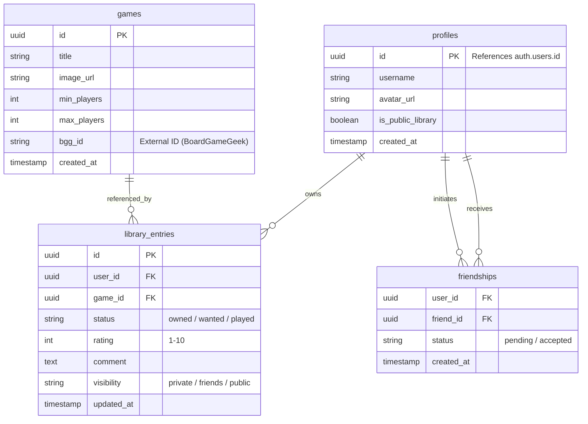

# Supabase Migration & Backend Architecture Plan

This document outlines the design and implementation plan for migrating the HARIDICE application backend from Firebase (Firestore) to Supabase (PostgreSQL).

## 1. Objectives

-   **Scalable Backend**: Move from a client-heavy NoSQL architecture to a structured Relational Database (RDB) to support complex queries and relationships.
-   **Social Features**: Enable "Friend" systems and public sharing of game libraries, which are difficult to implement efficiently in Firestore.
-   **Security**: Implement robust Row Level Security (RLS) policies to manage data visibility (Private/Friends/Public).

## 2. Database Schema Design (PostgreSQL)

### 2.1. ER Diagram Overview

### 2.2. Table Definitions & RLS Policies

#### `profiles` (Public User Info)
-   **RLS**:
    -   `SELECT`: Public (everyone can see usernames/avatars).
    -   `UPDATE`: Users can update their own profile only.

#### `games` (Master Data)
-   **RLS**:
    -   `SELECT`: Public.
    -   `INSERT`: Authenticated users (anyone can register a new game if it doesn't exist).
    -   `UPDATE`: Admin only (or trusted users).

#### `library_entries` (User's Collection)
-   **RLS**:
    -   `SELECT`:
        -   If `visibility` is 'public' -> Everyone.
        -   If `visibility` is 'friends' -> Only confirmed friends.
        -   If `visibility` is 'private' -> Only owner.
    -   `INSERT/UPDATE/DELETE`: Owner only.

#### `friendships` (Social Graph)
-   **RLS**:
    -   `SELECT`: Involved parties.
    -   `INSERT`: Authenticated users (requesting friendship).
    -   `UPDATE`: Receiver (accepting) or Sender (canceling).

## 3. API Design (Server Actions)

We will use **Next.js Server Actions** as our API layer, interacting directly with Supabase.

### 3.1. Game Management
-   `searchGames(query: string)`: Search games from local DB or external API (BGG).
-   `registerGame(gameData: Game)`: Add a new game to the master list.

### 3.2. Library Management
-   `addToLibrary(gameId: string, status: string)`: Add a game to user's collection.
-   `updateEntry(entryId: string, data: Partial<LibraryEntry>)`: Update rating, comment, visibility.
-   `removeFromLibrary(entryId: string)`: Delete an entry.
-   `getLibrary(userId: string)`: Fetch a user's library (respecting RLS).

### 3.3. Social Features
-   `sendFriendRequest(targetUserId: string)`
-   `acceptFriendRequest(requestId: string)`
-   `getFriends()`: List confirmed friends.
-   `getFriendActivity()`: (Future) Recent updates from friends.

## 4. Implementation Strategy

1.  **Supabase Setup**:
    -   Create a new Supabase project.
    -   Run migration scripts to create tables and RLS policies.
    -   Enable Auth providers (Google).

2.  **Frontend Integration**:
    -   Install `@supabase/ssr` and `@supabase/supabase-js`.
    -   Replace `AuthContext` (Firebase) with Supabase Auth.
    -   Update `useBoardgames` hook to fetch data via Server Actions instead of Firestore snapshots.

3.  **Data Migration**:
    -   Create a script to export Firestore data (`users`, `boardGames`, `userBoardGames`) to JSON.
    -   Import JSON data into Supabase tables using a seeding script.
