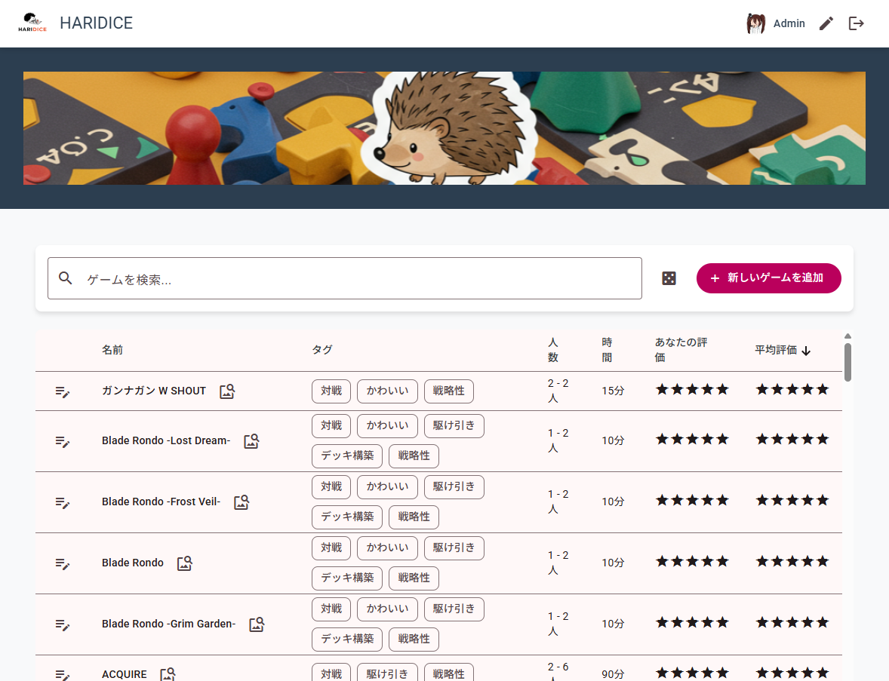

# HARIDICE - ボードゲーム管理アプリ

[](https://github.com/t-kajimoto/bg-manager/actions)

HARIDICEは、あなたが持っているボードゲームを簡単に記録・管理・評価できるWebアプリケーションです。友人やサークル仲間とボードゲームのリストを共有し、「次は何で遊ぶ？」をもっと楽しくします。

 

## ✨ 主要機能

-   **ボードゲームリスト**: 所有するボードゲームを一覧で表示。プレイ人数や時間、タグで絞り込み・ソートが可能。
-   **評価とコメント**: ゲームごとに5段階評価とコメントを記録し、みんなの評価を閲覧できます。
-   **プレイ状況の管理**: 「プレイ済み」「未プレイ」を簡単に管理できます。
-   **ボドゲガチャ**: 条件を指定して、遊ぶゲームをランダムに選出します。
-   **Google認証**: 面倒な会員登録は不要。お持ちのGoogleアカウントですぐに利用を開始できます。
-   **管理者機能**: 管理者として指定されたユーザーは、ボードゲームの追加・編集・削除が可能です。

## 🛠️ 技術スタック

このアプリケーションは、モダンなWeb技術を用いて構築されています。

-   **フロントエンド**: [Angular](https://angular.io/) (v19+), [TypeScript](https://www.typescriptlang.org/)
-   **UIライブラリ**: [Angular Material](https://material.angular.io/)
-   **バックエンド (BaaS)**: [Firebase](https://firebase.google.com/)
    -   **データベース**: Cloud Firestore (NoSQL)
    -   **認証**: Firebase Authentication (Googleログイン)
    -   **ホスティング**: Firebase Hosting
-   **CI/CD**: [GitHub Actions](https://github.co.jp/features/actions)

## 🚀 あなたの環境へのデプロイ手順

このリポジトリをフォークし、あなた自身のFirebase環境にHARIDICEをデプロイする手順を説明します。

### Step 1: 前提条件

-   [Node.js](https://nodejs.org/) (v18以上) がインストールされていること。
-   [Googleアカウント](https://www.google.com/account/about/)を持っていること。
-   [Git](https://git-scm.com/)がインストールされていること。

### Step 2: プロジェクトのセットアップ

1.  **このリポジトリをフォーク & クローン**
    ```bash
    git clone https://github.com/t-kajimoto/bg-manager.git
    cd bg-manager
    ```

2.  **依存関係をインストール**
    ```bash
    npm install
    ```

### Step 3: Firebaseプロジェクトの作成と設定

1.  **Firebaseプロジェクトを作成**
    -   [Firebaseコンソール](https://console.firebase.google.com/)にアクセスし、「プロジェクトを追加」から新しいプロジェクトを作成します（例: `my-haridice`）。

2.  **ウェブアプリを追加**
    -   プロジェクトの概要ページで、ウェブアイコン (`</>`) をクリックして新しいウェブアプリを追加します。
    -   アプリのニックネームを登録すると、`firebaseConfig`オブジェクトが表示されます。この内容は後で使います。

3.  **認証方法を有効化**
    -   左側のメニューから「Authentication」を選択し、「Sign-in method」タブを開きます。
    -   プロバイダの一覧から「Google」を選択し、有効にして保存します。

4.  **Firestore Databaseを作成**
    -   左側のメニューから「Firestore Database」を選択し、「データベースの作成」をクリックします。
    -   **テストモード**で開始し、ロケーションを選択して「有効にする」をクリックします。（セキュリティルールは後で設定します）

### Step 4: ローカル環境とFirebaseを接続

1.  **Firebase CLIをインストール**
    ```bash
    npm install -g firebase-tools
    ```

2.  **Firebaseにログイン**
    ```bash
    firebase login
    ```
    ブラウザが開き、Googleアカウントでの認証を求められます。

3.  **ローカルプロジェクトとFirebaseプロジェクトを紐付け**
    -   `.firebaserc` ファイルを開き、`default`の値をあなた自身のFirebaseプロジェクトIDに書き換えます。
        ```json
        // .firebaserc
        {
          "projects": {
            "default": "YOUR-FIREBASE-PROJECT-ID"
          }
        }
        ```

4.  **環境変数を設定**
    -   `src/environments/environment.ts` ファイルを開きます。
    -   Step 3-2で表示された`firebaseConfig`オブジェクトの内容をコピー＆ペーストします。
        ```typescript
        // src/environments/environment.ts
        export const environment = {
          production: false,
          firebase: {
            apiKey: "...",
            authDomain: "...",
            projectId: "...",
            storageBucket: "...",
            messagingSenderId: "...",
            appId: "..."
          }
        };
        ```

### Step 5: 管理者の設定とデプロイ

1.  **あなたを管理者に設定**
    -   `firestore.rules` ファイルを開きます。
    -   `YOUR_UID_HERE`と書かれている部分を、あなたのFirebase AuthenticationのUIDに置き換えます。（UIDは、一度アプリを起動してGoogleログインすると、FirebaseコンソールのAuthentication > Usersタブで確認できます）
        ```
        // firestore.rules
        allow write: if request.auth != null && request.auth.uid == 'YOUR_UID_HERE';
        ```

2.  **ローカルで動作確認**
    ```bash
    ng serve
    ```
    `http://localhost:4200` にアクセスし、Googleログインやボードゲームの追加ができることを確認します。

3.  **Firebaseにデプロイ！**
    ```bash
    # まずはアプリを本番用にビルド
    ng build

    # Firestoreのルールとホスティングをデプロイ
    firebase deploy
    ```

これで、あなた自身の環境でHARIDICEが動作します！

## 📄 設計ドキュメント

このアプリケーションのより詳細な設計や仕様については、`/document` フォルダ内の設計書を参照してください。

-   [**アプリケーション総合設計書**](./document/application-design-document.md)
-   [**データベース設計書**](./document/database-design-document.md)
-   [**各画面・機能ごとの詳細設計書**](./document/)

---

This project was generated with [Angular CLI](https://github.com/angular/angular-cli) version 17.3.6.