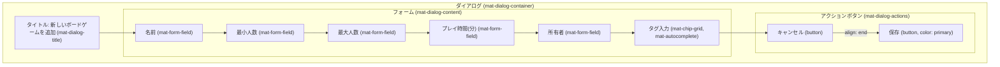
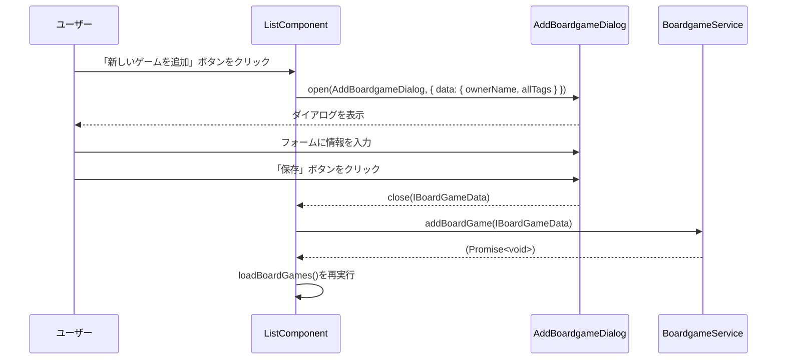

# ボードゲーム追加ダイアログ 設計書 (`add-boardgame-dialog.md`)

## 1. 概要

このダイアログは、管理者権限を持つユーザーが新しいボードゲームをデータベースに登録するためのUIを提供します。
`ListComponent` の「新しいゲームを追加」ボタンによって呼び出されます。

## 2. ファイル構成

-   **Component**: `src/app/page/list/add-boardgame-dialog/add-boardgame-dialog.component.ts`
-   **Template**: `src/app/page/list/add-boardgame-dialog/add-boardgame-dialog.component.html`
-   **Style**: `src/app/page/list/add-boardgame-dialog/add-boardgame-dialog.component.scss`

## 3. UIレイアウト図

## 4. コンポーネント仕様 (`AddBoardgameDialogComponent`)

### 4.1. クラスデコレーター

-   `@Component`: `standalone: true` であり、必要なモジュールを `imports` 配列で直接インポートします。

### 4.2. 入出力

-   **入力 (DI)**: `MAT_DIALOG_DATA`
    -   **型**: `Partial<IBoardGameData> & { allTags: string[] }`
    -   **説明**: `ListComponent`から渡される初期データ。所有者名の初期値や、タグ入力のオートコンプリート候補となる既存の全タグリストが含まれます。
-   **出力 (Dialog Result)**:
    -   **成功時**: `IBoardGameData`
    -   **キャンセル時**: `undefined`

### 4.3. フォームコントロールとバリデーション

| フィールド | コントロール | バリデーション | UI | 備考 |
| :--- | :--- | :--- | :--- | :--- |
| 名前 | `[(ngModel)]="data.name"` | **必須** (`required`) | `mat-form-field` | |
| 最小人数 | `[(ngModel)]="data.min"` | **必須**, 最小値: 1 | `mat-form-field` (number) | |
| 最大人数 | `[(ngModel)]="data.max"` | **必須**, 最小値: 1 | `mat-form-field` (number) | `min`以上の値であるべき（カスタムバリデーション検討） |
| 時間 | `[(ngModel)]="data.time"` | **必須**, 最小値: 1 | `mat-form-field` (number) | |
| 所有者 | `[(ngModel)]="data.ownerName"` | 必須 | `mat-form-field` | ログインユーザーの表示名が初期値として渡される |
| タグ | `tagCtrl` (FormControl) | - | `mat-chip-grid` | オートコンプリート機能付き |

### 4.4. 主要なメソッド

-   `onNoClick(): void`: ダイアログを閉じます。`dialogRef.close()` を呼び出します。戻り値はありません。
-   `addTag(event: MatChipInputEvent): void`: タグ入力欄で値が確定されたときに呼び出されます。入力値を`data.tags`配列に追加します。
-   `removeTag(tag: string): void`: タグの削除ボタンがクリックされたときに呼び出されます。`data.tags`配列から指定されたタグを削除します。
-   `selected(event: MatAutocompleteSelectedEvent): void`: オートコンプリートの候補が選択されたときに呼び出されます。選択された値を`data.tags`配列に追加します。

## 5. データフロー (シーケンス図)

1.  `ListComponent` が `dialog.open()` を呼び出し、ダイアログを開きます。このとき、`data`プロパティに所有者名の初期値と、タグのオートコンプリート候補となる`allTags`配列を渡します。
2.  ユーザーがフォームに入力します。
3.  ユーザーが「保存」ボタンをクリックすると、ダイアログは入力されたデータ (`IBoardGameData`) を結果として返して閉じます。
4.  `ListComponent` は返されたデータを受け取り、`BoardgameService`の`addBoardGame()`メソッドを呼び出してFirestoreへの保存処理を依頼します。
5.  保存後、`ListComponent`は`loadBoardGames()`を再実行してリストを更新します。