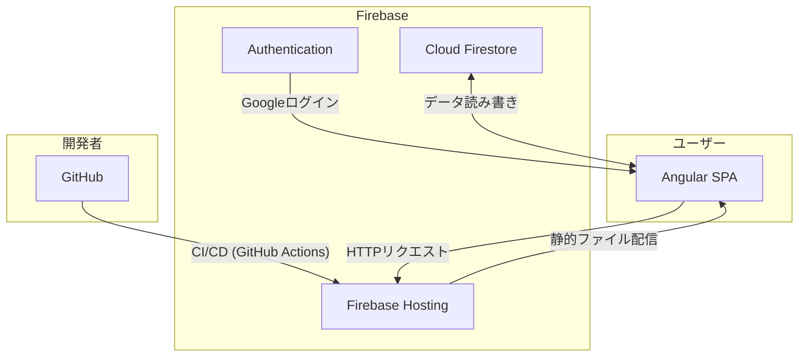

# アプリケーション総合設計書 (HARIDICE)

## 1. 概要

### 1.1. アプリケーションの目的

本アプリケーション「HARIDICE」は、個人またはサークルなどのコミュニティが所有するボードゲームをカタログ化し、管理することを目的としたWebアプリケーションです。
ユーザーはボードゲームの一覧を閲覧・検索できるほか、各ゲームに対する自身の評価やプレイ状況を記録することができます。また、特定の管理者ユーザーはボードゲームの情報を新規登録・編集することが可能です。

### 1.2. ターゲットユーザー

-   **一般ユーザー**: ボードゲームをプレイする人。どのゲームで遊ぶか探したり、自分のプレイ記録を付けたりする。
-   **管理者ユーザー**: ボードゲームを所有・管理する人。在庫の管理や情報のメンテナンスを行う。

### 1.3. 主要技術スタック

-   **フロントエンド**: Angular (v20+), TypeScript, SCSS (Standalone Components構成)
-   **UIライブラリ**: Angular Material
-   **バックエンド / BaaS**: Firebase (Google Cloud)
    -   **データベース**: Cloud Firestore
    -   **認証**: Firebase Authentication (Googleログイン)
    -   **ホスティング**: Firebase Hosting

---

## 2. システムアーキテクチャ

本システムは、Firebaseをバックエンドとして活用するサーバーレスアーキテクチャを採用しています。フロントエンドのAngularアプリケーションが、Firebase SDKを通じて認証、データベース、ホスティングの各サービスと直接通信します。



-   **Firebase Hosting**: ビルドされたAngularの静的ファイル（HTML, CSS, JS）をグローバルなCDNから配信します。
-   **Firebase Authentication**: Googleアカウントを利用した安全なユーザー認証を担当します。認証が成功すると、ユーザー情報（UID, トークン）をフロントエンドに提供します。
-   **Cloud Firestore**: アプリケーションのすべての永続データを格納するNoSQLデータベースです。セキュリティルールによって、サーバーレス環境でも安全なデータアクセスを実現します。
-   **Angular (SPA)**: ユーザーインターフェースとビジネスロジックのすべてを含みます。Firebase SDKを介して認証やデータベース操作をリアクティブに行います。

---

## 3. ディレクトリ構造

```
/src
|-- /app
|   |-- /components // 再利用可能な共有コンポーネント
|   |   |-- /confirmation-dialog
|   |   `-- /shared-tag-input
|   |-- /data // データモデル(Interface)定義
|   |   `-- boardgame.model.ts
|   |-- /page
|   |   `-- /list // メインのリストページ
|   |       |-- /add-boardgame-dialog
|   |       |-- /bodoge-gacha-dialog
|   |       |-- /edit-nickname-dialog
|   |       |-- /edit-user-data-dialog
|   |       `-- list.component.ts
|   |-- /services // ビジネスロジック
|   |   |-- auth.service.ts
|   |   `-- boardgame.service.ts
|   |-- app.component.ts // ルートコンポーネント
|   |-- app.config.ts    // アプリケーション設定
|   `-- app.routes.ts    // ルーティング定義
|-- /assets // 画像などの静的アセット
|-- /environments // 環境変数
`-- styles.scss // グローバルスタイル
```

---

## 4. フロントエンド設計

### 4.1. 主要サービスと責務

-   **`AuthService`**: 認証とユーザープロファイル管理の責務を負います。
    -   **主な機能**: 
        -   Googleログイン/ログアウト処理。
        -   現在のユーザーの認証状態 (`Observable<User|null>`) を提供。
        -   ユーザーのUID、ニックネーム、管理者フラグ (`isAdmin$`) などのプロファイル情報を`Observable`として提供。
        -   Firestoreの`users`コレクションへのユーザー情報保存・更新。

-   **`BoardgameService`**: Firestoreデータベースとの通信に関するロジックをすべてカプセル化します。
    -   **主な機能**:
        -   `boardGames`と`userBoardGames`コレクションに対するCRUD（作成、読み取り、更新、削除）操作。
        -   複雑なデータ結合処理（ゲーム情報＋ユーザー評価＋平均評価など）をRxJSオペレータを用いて行い、コンポーネントが扱いやすい`Observable<IBoardGame[]>`の形式で提供。

### 4.2. 主要コンポーネントと責務

-   **`AppComponent`** (ルートコンポーネント)
    -   **責務**: 全ページ共通のツールバー（ヘッダー）の表示。ログイン/ログアウト機能、ニックネーム編集ダイアログの呼び出し。
    -   **依存サービス**: `AuthService`
    -   **呼び出すダイアログ**: `EditNicknameDialogComponent`

-   **`ListComponent`** (メインページ: `/`)
    -   **責務**: ボードゲーム一覧の表示、リアルタイム検索、ソート。
    -   **依存サービス**: `BoardgameService`, `AuthService`
    -   **呼び出すダイアログ**: `AddBoardgameDialogComponent`, `EditUserDataDialogComponent`, `BodogeGachaDialogComponent`
    -   **子コンポーネント**: なし (すべてAngular Materialのコンポーネントを利用)

-   **Dialog Components** (各種ダイアログ)
    -   **責務**: 特定のタスク（データの入力や編集、確認）に特化したUIをモーダル形式で提供。`MatDialog`によって動的に生成され、終了時に結果を呼び出し元に返します。
    -   **例**: `EditUserDataDialogComponent`
        -   **入力データ (`data`)**: `EditUserDataDialogData` (対象のボードゲーム情報、管理者フラグなど)
        -   **返却データ**: 更新されたボードゲーム情報、または`'deleted'`のような状態を示す文字列。
        -   **依存サービス**: `BoardgameService`
        -   **呼び出すダイアログ**: `ConfirmationDialogComponent` (削除確認のため)

---

## 5. データベース設計

詳細は[データベース設計書](./database-design-document.md)を参照。

## 6. ビルドとデプロイ

-   **設定ファイル**: `firebase.json`
    -   `firestore.rules`: デプロイ対象のセキュリティルールファイルを指定します。
    -   `hosting.public`: デプロイする静的ファイルが含まれるディレクトリ（`dist/bg-manager/browser`）を指定します。
    -   `hosting.rewrites`: すべてのURLリクエストを`/index.html`にリダイレクトし、Angularのクライアントサイドルーティングを機能させます。
-   **CI/CD**: `.github/workflows/firebase-hosting.yml`
    -   `main`ブランチへのプッシュをトリガーに、GitHub Actionsが自動的にビルドとFirebase Hostingへのデプロイを実行します。
-   **手動デプロイコマンド**:
    -   `npm run build`: Angular CLIを使ってアプリケーションをビルドし、`dist/`ディレクトリに成果物を生成します。
    -   `firebase deploy`: `firebase.json`の設定に基づき、HostingのファイルとFirestoreのルールをデプロイします。