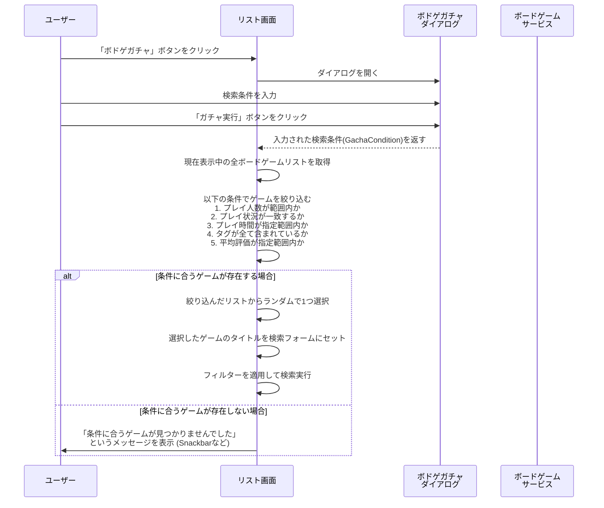

# ボドゲガチャダイアログ 設計書 (`bodoge-gacha-dialog.md`)

## 1. 概要

このダイアログは、ユーザーが指定した条件に合うボードゲームをランダムに1つ提案する「ボドゲガチャ」機能を提供します。
`ListComponent` の検索フォーム横に設置される「ボドゲガチャ」ボタンによって呼び出されます。

## 2. ファイル構成

-   **Component**: `src/app/page/list/bodoge-gacha-dialog/bodoge-gacha-dialog.component.ts`
-   **Template**: `src/app/page/list/bodoge-gacha-dialog/bodoge-gacha-dialog.component.html`
-   **Style**: `src/app/page/list/bodoge-gacha-dialog/bodoge-gacha-dialog.component.scss`

## 3. UI要素とレイアウト

ダイアログはAngular Materialのコンポーネントで構成されます。

-   **ダイアログタイトル (`mat-dialog-title`)**: 「ボドゲガチャ」
-   **入力フォーム (`mat-dialog-content`)**:
    -   **人数 (`mat-form-field`)**: プレイしたい人数を入力。必須項目。数値型。
        -   `[(ngModel)]="data.players"`
    -   **プレイ状況 (`mat-radio-group`)**: ユーザーのプレイ状況で絞り込む。
        -   `[(ngModel)]="data.playStatus"`
        -   選択肢: 「指定なし」「プレイ済み」「未プレイ」
    -   **タグ (`mat-form-field` と `mat-chip-list`)**: 特定のタグを持つゲームに絞り込む。
        -   `[(ngModel)]="data.tags"`
        -   既存のタグ入力コンポーネントと同様の実装。
    -   **プレイ時間 (`mat-range-slider`)**: 指定したプレイ時間範囲のゲームに絞り込む。
        -   `[(ngModel)]="data.timeRange"`
        -   `min` プロパティで最小値 (0)、`max` プロパティで最大値 (180)、`step` プロパティで刻み (5) を設定します。
        -   `data.timeRange` は `{ min: number; max: number; }` 形式のオブジェクトになります。
    -   **平均評価の範囲 (`mat-range-slider`)**: 指定した評価範囲のゲームに絞り込む。
        -   `[(ngModel)]="data.ratingRange"`
        -   `min` プロパティで最小値 (0)、`max` プロパティで最大値 (5)、`step` プロパティで刻み (0.1) を設定します。
        -   `data.ratingRange` は `{ min: number; max: number; }` 形式のオブジェクトになります。
-   **アクションボタン (`mat-dialog-actions`)**:
    -   **キャンセルボタン (`mat-button`)**: `(click)="onNoClick()"`。ダイアログを閉じます。
    -   **ガチャ実行ボタン (`mat-button`)**: `[mat-dialog-close]="data"`。入力された条件 `data` をダイアログの呼び出し元に返します。

## 4. コンポーネント仕様 (`BodogeGachaDialogComponent`)

### 4.1. クラスデコレーター

-   `@Component`: `standalone: true` であり、必要なモジュールを `imports` 配列で直接インポートします。
    -   `CommonModule`, `MatFormFieldModule`, `MatInputModule`, `FormsModule`, `MatButtonModule`, `MatDialogModule`, `MatChipsModule`, `MatIconModule`, `MatRadioModule`, `MatSliderModule`

### 4.2. プロパティ

-   `data: GachaCondition`: ダイアログ内でユーザーが入力した条件を保持するオブジェクトです。
    -   `GachaCondition` は `{ players: number; playStatus: 'played' | 'unplayed' | 'any'; tags: string[]; timeRange: { min: number; max: number; }; ratingRange: { min: number; max: number; }; }` のようなインターフェースになります。

### 4.3. メソッド

-   `onNoClick(): void`: ダイアログを閉じます。`dialogRef.close()` を呼び出します。戻り値はありません。

## 5. データフローと `ListComponent` との連携

`ListComponent` は、このダイアログから返された条件を元にガチャ処理を実行します。

### 5.1. `ListComponent` の変更点

-   **ボドゲガチャボタンの追加**:
    -   検索フォームの横に `casino` アイコンの `mat-icon-button` を配置します。
    -   このボタンは `openGachaDialog()` メソッドを呼び出します。
-   **`openGachaDialog()` メソッドの追加**:
    1.  `MatDialog` サービスを使って `BodogeGachaDialogComponent` を開きます。
    2.  ダイアログが閉じた後 (`afterClosed()`)、返された `GachaCondition` を受け取ります。
    3.  条件が指定されている場合、`executeGacha(condition)` メソッドを呼び出します。
-   **`executeGacha(condition)` メソッドの追加**:
    1.  `this.dataSource.data` (フィルタリングされていない全データ) を元に、`condition` に基づいてゲームを絞り込みます。
    2.  絞り込んだ結果が1件以上ある場合、ランダムに1件を選択します。
    3.  選択したゲームの `name` を検索フォームの `FormControl` に `setValue()` します。
    4.  `applyFilter()` を手動で呼び出し、テーブルの表示を更新します。
    5.  絞り込んだ結果が0件の場合、`MatSnackBar` を使ってユーザーに通知します。
