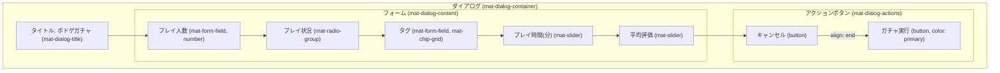
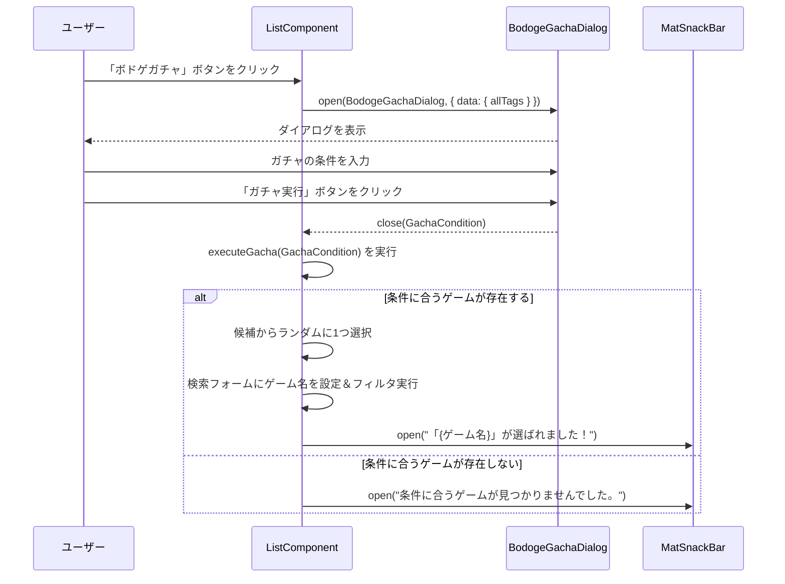

# ボドゲガチャダイアログ 設計書 (`bodoge-gacha-dialog.md`)

## 1. 概要

このダイアログは、ユーザーが指定した条件に合うボードゲームをランダムに1つ提案する「ボドゲガチャ」機能を提供します。
`ListComponent` の検索フォーム横に設置される「ボドゲガチャ」ボタンによって呼び出されます。

## 2. ファイル構成

-   **Component**: `src/app/page/list/bodoge-gacha-dialog/bodoge-gacha-dialog.component.ts`
-   **Template**: `src/app/page/list/bodoge-gacha-dialog/bodoge-gacha-dialog.component.html`
-   **Style**: `src/app/page/list/bodoge-gacha-dialog/bodoge-gacha-dialog.component.scss`

## 3. UIレイアウト図



## 4. コンポーネント仕様 (`BodogeGachaDialogComponent`)

### 4.1. データモデル

```typescript
// ダイアログに渡されるデータ
export interface GachaDialogData {
  allTags: string[];
}

// ダイアログが返すデータ（ガチャの条件）
export interface GachaCondition {
  players: number | null;
  playStatus: 'played' | 'unplayed' | 'any';
  tags: string[];
  timeRange: { min: number; max: number; };
  ratingRange: { min: number; max: number; };
}
```

### 4.2. 入出力

-   **入力 (DI)**: `MAT_DIALOG_DATA`
    -   **型**: `GachaDialogData`
    -   **説明**: `ListComponent`から渡される、タグ入力のオートコンプリート候補となる既存の全タグリスト。
-   **出力 (Dialog Result)**:
    -   **実行時**: `GachaCondition` (ユーザーが設定したガチャの条件)
    -   **キャンセル時**: `undefined`

### 4.3. フォームコントロールとデフォルト値

| フィールド | コントロール | デフォルト値 | 備考 |
| :--- | :--- | :--- | :--- |
| プレイ人数 | `[(ngModel)]="data.players"` | `null` | |
| プレイ状況 | `[(ngModel)]="data.playStatus"` | `'any'` | ラジオボタン |
| タグ | `tagCtrl` (FormControl) | `[]` | オートコンプリート機能付き |
| プレイ時間 | `[(ngModel)]="data.timeRange"` | `{ min: 0, max: 180 }` | `mat-slider` |
| 平均評価 | `[(ngModel)]="data.ratingRange"` | `{ min: 0, max: 5 }` | `mat-slider` |

## 5. データフローとガチャ実行ロジック

### 5.1. シーケンス図



### 5.2. `ListComponent`でのガチャ実行ロジック (`executeGacha`)

1.  `BodogeGachaDialog`から`GachaCondition`オブジェクトを受け取ります。
2.  現在の`dataSource.data`（フィルタリングされていない全ボードゲームリスト）を候補リストとします。
3.  以下の条件で候補リストを順番に絞り込みます(`Array.prototype.filter`)。
    -   **プレイ人数**: `condition.players`が指定されている場合、`game.min <= players && game.max >= players`の条件で絞り込みます。
    -   **プレイ状況**: `condition.playStatus`が`'any'`でない場合、`game.played`が指定された状態と一致するかで絞り込みます。
    -   **プレイ時間**: `game.time`が`condition.timeRange`の範囲内であるかで絞り込みます。
    -   **タグ**: `condition.tags`が空でない場合、`game.tags`が指定されたタグを**すべて**含んでいるかで絞り込みます。
    -   **平均評価**: `game.averageEvaluation`が`condition.ratingRange`の範囲内であるかで絞り込みます。
4.  最終的に残った候補リストの件数を確認します。
    -   **1件以上の場合**: `Math.random()`を使用してリストからランダムに1件のゲームを選択します。選択したゲームの名前を検索フォームにセットし、フィルタを適用します。`MatSnackBar`で結果をユーザーに通知します。
    -   **0件の場合**: `MatSnackBar`で、条件に合うゲームがなかったことをユーザーに通知します。