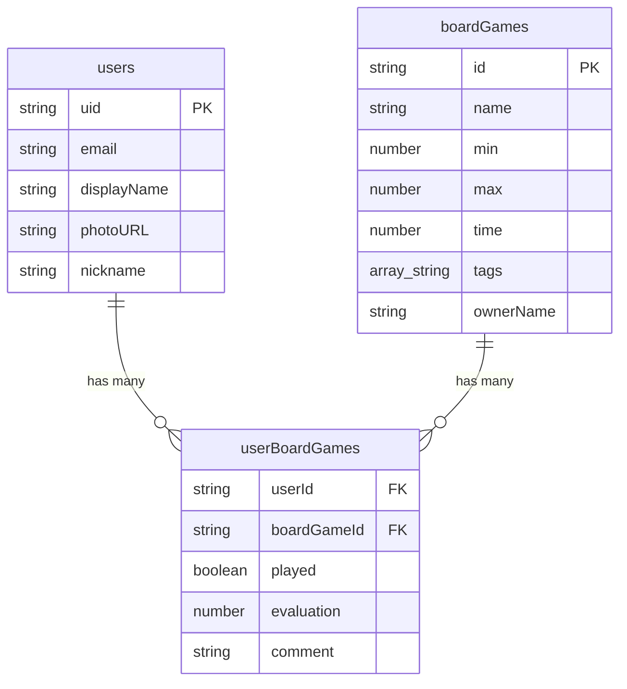

# データベース設計書 (Cloud Firestore)

## 1. 概要

本ドキュメントは、HARIDICEアプリケーションが使用するCloud Firestoreデータベースの論理設計と物理設計を定義します。
データベースは、ボードゲームのカタログ情報、ユーザー情報、および各ユーザーのゲームに対するインタラクション情報を格納するために使用されます。

## 2. 設計思想

-   **非正規化の活用**: NoSQLデータベースの特性を活かし、読み取りパフォーマンスを最適化するために、一部のデータは意図的に重複して保持します。（例: `boardGames` に `ownerName` を保持）
-   **クライアントでのJoin**: FirestoreはサーバーサイドでのJoinをサポートしないため、複数のコレクションにまたがるデータの結合は、クライアントサイド（Angularの `BoardgameService`）でRxJSを用いて行います。
-   **スケーラビリティ**: コレクションとドキュメントの構造は、将来的なデータ量の増加に対応できるよう、浅いクエリで完結するように設計されています。

## 3. コレクション詳細

### 3.1. `boardGames`

ボードゲームのマスターデータを格納するコレクション。

-   **コレクションパス**: `/boardGames`
-   **ドキュメントID**: Firestoreによって自動生成される一意のID (`auto-id`)
-   **対応インターフェース**: `IBoardGameData`

#### フィールド定義

| フィールド名 | データ型 | 必須 | 説明 | 備考 |
| :--- | :--- | :--- | :--- | :--- |
| `name` | `string` | ✔ | ボードゲームの正式名称。 | 検索対象。 |
| `min` | `number` | ✔ | プレイ可能な最小人数。 | |
| `max` | `number` | ✔ | プレイ可能な最大人数。 | |
| `time` | `number` | ✔ | おおよそのプレイ時間（分単位）。 | |
| `tags` | `array<string>` | | ゲームの分類や特徴を示すタグの配列。 | 例: `["協力型", "戦略"]` |
| `ownerName` | `string` | | このボードゲームの主な所有者名。 | ユーザーのニックネームが変更されても追従しない。登録時のスナップショット。 |

### 3.2. `users`

アプリケーションのユーザー情報を格納するコレクション。

-   **コレクションパス**: `/users`
-   **ドキュメントID**: Firebase AuthenticationのユーザーUID (`request.auth.uid`)
-   **対応インターフェース**: `IUser`

#### フィールド定義

| フィールド名 | データ型 | 必須 | 説明 | 備考 |
| :--- | :--- | :--- | :--- | :--- |
| `uid` | `string` | ✔ | Firebase Authenticationから提供される一意のユーザーID。 | ドキュメントIDと同一。 |
| `email` | `string` | ✔ | ユーザーのメールアドレス。 | Google認証から取得。 |
| `displayName` | `string` | ✔ | Googleアカウントの表示名。 | |
| `photoURL` | `string` | ✔ | Googleアカウントのプロフィール写真のURL。 | |
| `nickname` | `string` | | ユーザーがアプリ内で設定したニックネーム。 | 未設定の場合は `displayName` を使用。 |

### 3.3. `userBoardGames`

ユーザーとボードゲームの関連情報（多対多の関係）を格納するコレクション。

-   **コレクションパス**: `/userBoardGames`
-   **ドキュメントID**: `${userId}_${boardGameId}` の形式でクライアントサイドで生成される複合ID。
-   **対応インターフェース**: `IBoardGameUserFirestore`

#### フィールド定義

| フィールド名 | データ型 | 必須 | 説明 | 備考 |
| :--- | :--- | :--- | :--- | :--- |
| `userId` | `string` | ✔ | この記録を所有するユーザーのID (UID)。 | クエリの `where` 句で使用。 |
| `boardGameId` | `string` | ✔ | 対象となるボードゲームのID。 | クエリの `where` 句で使用。 |
| `played` | `boolean` | ✔ | ユーザーがこのゲームをプレイしたことがあるか。 | |
| `evaluation` | `number` | ✔ | ユーザーによる5段階評価 (1-5)。 | 0は未評価を表す。 |
| `comment` | `string` | | ユーザーが残したひとことコメント。 | |

## 4. データモデル図

## 5. クエリパターン

このデータベース設計で想定される主要なクエリは以下の通りです。

1.  **全ボードゲームリストの表示 (ListComponent)**:
    -   `boardGames` コレクションの全ドキュメントを取得。
    -   ログインユーザーの `userId` を使って、`userBoardGames` コレクションから該当ユーザーの全ドキュメント (`where("userId", "==", userId)`) を取得。
    -   クライアントサイドで、`boardGameId` をキーにして2つのデータを結合する。
    -   さらに、各ゲームについて `userBoardGames` から全ユーザーの評価 (`where("boardGameId", "==", game.id)`) を取得し、平均評価を計算して結合する。

2.  **ユーザーのプロフィール取得 (BoardgameService)**:
    -   `users` コレクションから特定の `userId` のドキュメントを直接取得する。

3.  **データ更新 (EditUserDataDialog)**:
    -   ユーザーの評価更新時: `userBoardGames` の特定のドキュメント (`${userId}_${boardGameId}`) を直接更新する。
    -   管理者のゲーム情報更新時: `boardGames` の特定のドキュメントを直接更新する。

