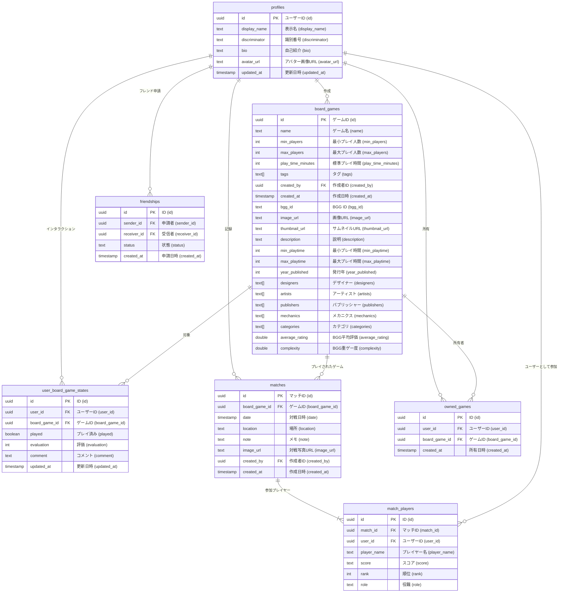

# データベース設計書 (Supabase PostgreSQL)

## 1. 概要

本ドキュメントは、ボードゲーム管理アプリケーション「HARIDICE」が使用するSupabase (PostgreSQL) データベースの論理設計と物理設計を定義します。
データベースは、ボードゲームのカタログ情報、ユーザープロファイル、各ユーザーのゲームに対するインタラクション（評価やプレイ状況）、および対戦記録を格納する責務を負います。

## 2. 設計思想

- **リレーショナルモデル**: PostgreSQLのリレーショナルデータベース機能を活用し、データ整合性を保ちます。
- **Row Level Security (RLS)**: SupabaseのRLS機能を使用して、データアクセス制御をデータベースレベルで強制します。
- **Server Actions**: Next.jsのServer Actionsを通じてデータベース操作を行い、セキュアで効率的なデータアクセスを実現します。

## 3. データモデル図 (ER図)

## 4. テーブル詳細

### 4.1. ユーザープロフィール (profiles)

ユーザーの公開プロフィール情報を格納します。`auth.users` テーブルと1対1で対応します。

| 論理名 (物理名)                        | データ型    | 必須 | 説明                           | 備考                   |
| :------------------------------------- | :---------- | :--- | :----------------------------- | :--------------------- |
| ユーザーID (id)                        | `uuid`      | ✔    | ユーザーを一意に識別するID     | `auth.users.id` を参照 |
| 表示名 (display_name)                  | `text`      |      | ユーザーが決める表示名         |                        |
| 識別番号 (discriminator)               | `text`      |      | 重複を避けるための4桁の数字    |                        |
| 自己紹介 (bio)                         | `text`      |      | 簡単なプロフィール説明         |                        |
| アバター画像URL (avatar_url)           | `text`      |      | プロフィール画像のURL          |                        |
| 公開設定:ゲーム (visibility_games)     | `text`      | ✔    | 'public', 'friends', 'private' | デフォルト 'public'    |
| 公開設定:戦績 (visibility_matches)     | `text`      | ✔    | 'public', 'friends', 'private' | デフォルト 'public'    |
| 公開設定:フレンド (visibility_friends) | `text`      | ✔    | 'public', 'friends', 'private' | デフォルト 'public'    |
| 公開設定:一覧 (visibility_user_list)   | `text`      | ✔    | 'public', 'friends', 'private' | デフォルト 'public'    |
| 更新日時 (updated_at)                  | `timestamp` |      | レコードの最終更新日時         |                        |

### 4.2. ボードゲーム (board_games)

ボードゲームのマスターデータを格納します。
※ `tags` カラムは、アプリ独自のタグ付けとして使用します。BGG由来の `mechanics` や `categories` とは区別して管理することを推奨しますが、運用上 `tags` に統合することも可能です。今回は明確化のため別途カラム定義しています。

| 論理名 (物理名)                    | データ型    | 必須 | 説明                             | 備考                |
| :--------------------------------- | :---------- | :--- | :------------------------------- | :------------------ |
| ゲームID (id)                      | `uuid`      | ✔    | ボードゲームを一意に識別するID   | 自動生成            |
| ゲーム名 (name)                    | `text`      | ✔    | ゲームの名称                     |                     |
| 最小プレイ人数 (min_players)       | `int`       | ✔    | プレイ可能な最小人数             |                     |
| 最大プレイ人数 (max_players)       | `int`       | ✔    | プレイ可能な最大人数             |                     |
| 標準プレイ時間 (play_time_minutes) | `int`       | ✔    | プレイにかかる標準的な時間（分） |                     |
| タグ (tags)                        | `text[]`    |      | アプリ独自のタグ                 |                     |
| 所有者名 (owner_name)              | `text`      |      | 所有者の名前 (非推奨/レガシー)   | `created_by` の代替 |
| 作成日時 (created_at)              | `timestamp` |      | レコード作成日時                 |                     |
| BGG ID (bgg_id)                    | `text`      |      | BoardGameGeek上のID              | ユニーク            |
| 画像URL (image_url)                | `text`      |      | ゲームのメイン画像URL            | BGGより取得         |
| サムネイルURL (thumbnail_url)      | `text`      |      | ゲームのサムネイル画像URL        | BGGより取得         |
| 説明 (description)                 | `text`      |      | ゲームの説明文                   | BGGより取得         |
| 最小プレイ時間 (min_playtime)      | `int`       |      | BGGデータ上の最小プレイ時間      | BGGより取得         |
| 最大プレイ時間 (max_playtime)      | `int`       |      | BGGデータ上の最大プレイ時間      | BGGより取得         |
| 発行年 (year_published)            | `int`       |      | ゲームの発行年                   | BGGより取得         |
| デザイナー (designers)             | `text[]`    |      | デザイナー名リスト               | BGGより取得         |
| アーティスト (artists)             | `text[]`    |      | アーティスト名リスト             | BGGより取得         |
| パブリッシャー (publishers)        | `text[]`    |      | パブリッシャー名リスト           | BGGより取得         |
| メカニクス (mechanics)             | `text[]`    |      | ゲームメカニクス                 | BGGより取得         |
| カテゴリ (categories)              | `text[]`    |      | ゲームカテゴリ                   | BGGより取得         |
| BGG平均評価 (average_rating)       | `double`    |      | BGG上の平均評価                  | BGGより取得         |
| BGG重ゲー度 (complexity)           | `double`    |      | BGG上のComplexity (Weight)       | BGGより取得         |

### 4.3. ユーザー別ゲーム状態 (user_board_game_states)

ユーザーごとのゲームに対する状態（評価、プレイ状況など）を格納します。

| 論理名 (物理名)          | データ型    | 必須 | 説明                           | 備考                     |
| :----------------------- | :---------- | :--- | :----------------------------- | :----------------------- |
| ID (id)                  | `uuid`      | ✔    | レコードID                     | 自動生成                 |
| ユーザーID (user_id)     | `uuid`      | ✔    | 状態を保持するユーザーのID     | `Link to profiles.id`    |
| ゲームID (board_game_id) | `uuid`      | ✔    | 対象のボードゲームID           | `Link to board_games.id` |
| プレイ済み (played)      | `boolean`   |      | プレイ経験の有無               |                          |
| 評価 (evaluation)        | `int`       |      | 5段階評価 (1-5)                |                          |
| コメント (comment)       | `text`      |      | ゲームに対するひとことコメント |                          |
| 更新日時 (updated_at)    | `timestamp` |      | レコードの最終更新日時         |                          |

### 4.4. 対戦記録 (matches)

対戦記録（マッチ）の基本情報を格納します。

| 論理名 (物理名)          | データ型    | 必須 | 説明                       | 備考                     |
| :----------------------- | :---------- | :--- | :------------------------- | :----------------------- |
| マッチID (id)            | `uuid`      | ✔    | 対戦記録ID                 | 自動生成                 |
| ゲームID (board_game_id) | `uuid`      | ✔    | プレイしたゲームのID       | `Link to board_games.id` |
| 対戦日時 (date)          | `timestamp` | ✔    | ゲームをプレイした日時     |                          |
| 場所 (location)          | `text`      |      | プレイした場所             |                          |
| メモ (note)              | `text`      |      | 対戦に関するメモ           |                          |
| 対戦写真URL (image_url)  | `text`      |      | 対戦時の写真URL            | Supabase Storage         |
| 作成者ID (created_by)    | `uuid`      | ✔    | 記録を作成したユーザーのID | `auth.users.id` を参照   |
| 作成日時 (created_at)    | `timestamp` |      | レコード作成日時           |                          |

### 4.5. 対戦参加プレイヤー (match_players)

各マッチに参加したプレイヤーごとのスコアや勝敗情報を格納します。

| 論理名 (物理名)            | データ型 | 必須 | 説明                     | 備考                       |
| :------------------------- | :------- | :--- | :----------------------- | :------------------------- |
| ID (id)                    | `uuid`   | ✔    | レコードID               | 自動生成                   |
| マッチID (match_id)        | `uuid`   | ✔    | 紐づく対戦記録のID       | `Link to matches.id`       |
| ユーザーID (user_id)       | `uuid`   |      | アプリユーザーの場合のID | 登録済みユーザーの場合のみ |
| プレイヤー名 (player_name) | `text`   | ✔    | プレイヤーの名前         | 未登録ユーザーまたは表示名 |
| スコア (score)             | `text`   |      | ゲームのスコア           | フリーフォーマット         |
| 順位 (rank)                | `int`    |      | 最終順位                 | 1位、2位…                  |
| 役職 (role)                | `text`   |      | ゲーム内の役職や担当     |                            |

### 4.6. 所有ゲーム (owned_games)

どのユーザーがどのゲームを所有しているかを管理します。

| 論理名 (物理名)          | データ型    | 必須 | 説明             | 備考                    |
| :----------------------- | :---------- | :--- | :--------------- | :---------------------- |
| ID (id)                  | `uuid`      | ✔    | レコードID       | 自動生成                |
| ユーザーID (user_id)     | `uuid`      | ✔    | 所有ユーザーのID | `profiles.id` を参照    |
| ゲームID (board_game_id) | `uuid`      | ✔    | 所有ゲームのID   | `board_games.id` を参照 |
| 所有日時 (created_at)    | `timestamp` |      | データ登録日時   |                         |

### 4.7. フレンド関係 (friendships)

ユーザー同士のフレンド状態を管理します。

| 論理名 (物理名)       | データ型    | 必須 | 説明                              | 備考                       |
| :-------------------- | :---------- | :--- | :-------------------------------- | :------------------------- |
| ID (id)               | `uuid`      | ✔    | レコードID                        | 自動生成                   |
| 申請者 (sender_id)    | `uuid`      | ✔    | 申請を送ったユーザーのID          | `profiles.id` を参照       |
| 受信者 (receiver_id)  | `uuid`      | ✔    | 申請を受け取ったユーザーのID      | `profiles.id` を参照       |
| 状態 (status)         | `text`      | ✔    | 'pending', 'accepted', 'rejected' | 申請中, 承認済み, 拒否済み |
| 申請日時 (created_at) | `timestamp` |      | レコード作成日時                  |                            |

## 5. セキュリティ (RLS Policies)

SupabaseのRow Level Security (RLS) を有効化し、以下のポリシーを適用しています。

- **全テーブル共通**:
  - `SELECT`: 公開情報（認証不要）または Authenticated なユーザーは基本的に参照可能。
  - `INSERT/UPDATE/DELETE`: 認証済みユーザーのみ許可。

- **ユーザープロフィール (profiles)**:
  - `INSERT/UPDATE` は本人のみ (`auth.uid() = id`)。

- **ユーザー別ゲーム状態 (user_board_game_states)**:
  - `INSERT/UPDATE` は本人のデータのみ (`auth.uid() = user_id`)。

- **対戦記録 (matches)**:
  - `INSERT`: 認証済みユーザーのみ。
  - `UPDATE/DELETE`: 作成者本人のみ (`auth.uid() = created_by`)。

- **対戦参加プレイヤー (match_players)**:
  - `UPDATE/DELETE`: 親となるMatchの作成者のみ (`auth.uid() = created_by` via join)。

- **所有ゲーム (owned_games)**:
  - `SELECT`: 全員（公開情報の集計などのため）。
  - `INSERT/DELETE`: 本人のみ (`auth.uid() = user_id`)。

## 6. ストレージ (Supabase Storage)

対戦記録などに添付する画像を保存するために使用します。

### 6.1. バケット: `match_images`

- **公開設定**: 公開 (Public) - URLで画像を参照できるようにするため。
- **制限**:
  - ファイルサイズ: 最大 5MB
  - ファイル形式: `image/*` (png, jpeg, webp等)
- **RLSポリシー**:
  - `SELECT`: 誰でも参照可能。
  - `INSERT`: 認証済みユーザー。
  - `UPDATE/DELETE`: アップロードした本人のみ (`auth.uid()` によるパスのプレフィックス一致など)。

### 6.2. バケット: `profile_images`

- **公開設定**: 公開 (Public) - URLでプロフィール画像を参照できるようにするため。
- **制限**:
  - ファイルサイズ: 最大 2MB
  - ファイル形式: `image/*`
- **RLSポリシー**:
  - `SELECT`: 誰でも参照可能。
  - `INSERT/UPDATE/DELETE`: 本人のみ (`auth.uid()` によるパスの制限)。
