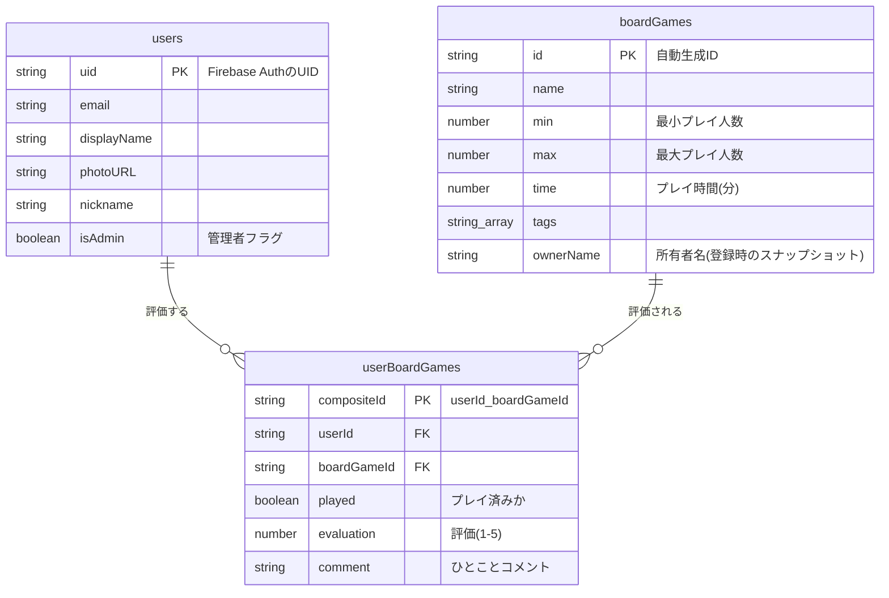

# データベース設計書 (Cloud Firestore)

## 1. 概要

本ドキュメントは、ボードゲーム管理アプリケーション「HARIDICE」が使用するCloud Firestoreデータベースの論理設計と物理設計を定義します。
データベースは、ボードゲームのカタログ情報、ユーザープロファイル、および各ユーザーのゲームに対するインタラクション（評価やプレイ状況）を格納する責務を負います。

## 2. 設計思想

-   **非正規化の戦略的活用**: NoSQLデータベースの特性を活かし、読み取りパフォーマンスを最適化するために、一部のデータは意図的に重複して保持します。例えば、`boardGames`コレクションに`ownerName`を保持することで、ゲームリスト表示の際に`users`コレクションへの問い合わせを不要にしています。
-   **クライアントサイドでのデータ結合**: FirestoreはサーバーサイドでのJoin操作をサポートしないため、複数のコレクションにまたがるデータの結合は、クライアントサイド（主にAngularの`BoardgameService`）でRxJSを用いてリアクティブに行います。
-   **スケーラビリティとパフォーマンス**: コレクションとドキュメントの構造は、将来的なデータ量の増加に対応できるよう、クエリが常にドキュメントの深さに依存せず、高速に実行可能な「浅いクエリ」で完結するように設計されています。

## 3. データモデル図 (ER図)



## 4. コレクション詳細

### 4.1. `users`

アプリケーションのユーザープロファイル情報を格納するコレクション。

-   **コレクションパス**: `/users`
-   **ドキュメントID**: Firebase Authenticationによって発行されるユーザーUID (`request.auth.uid`) を使用します。これにより、認証情報とデータベースのユーザー情報が一対一で対応します。
-   **対応インターフェース**: `IUser`

#### フィールド定義

| フィールド名 | データ型 | 必須 | 説明 | 備考 |
| :--- | :--- | :--- | :--- | :--- |
| `uid` | `string` | ✔ | Firebase Authenticationから提供される一意のユーザーID。 | ドキュメントIDと同一。 |
| `email` | `string` | ✔ | ユーザーのメールアドレス。 | Google認証から取得。 |
| `displayName` | `string` | ✔ | Googleアカウントの表示名。 | |
| `photoURL` | `string` | ✔ | Googleアカウントのプロフィール写真のURL。 | |
| `nickname` | `string` | | ユーザーがアプリ内で設定したニックネーム。 | 未設定の場合は `displayName` をフォールバックとして使用。 |
| `isAdmin` | `boolean` | | ユーザーが管理者権限を持つかを示すフラグ。 | デフォルトは`false`。管理者による手動設定が必要。 |

### 4.2. `boardGames`

ボードゲームのカタログ情報（マスターデータ）を格納するコレクション。

-   **コレクションパス**: `/boardGames`
-   **ドキュメントID**: Firestoreによって自動生成される一意のID (`auto-id`) を使用します。
-   **対応インターフェース**: `IBoardGameData`

#### フィールド定義

| フィールド名 | データ型 | 必須 | 説明 | 備考 |
| :--- | :--- | :--- | :--- | :--- |
| `name` | `string` | ✔ | ボードゲームの正式名称。 | 全文検索の対象。 |
| `min` | `number` | ✔ | プレイ可能な最小人数。 | |
| `max` | `number` | ✔ | プレイ可能な最大人数。 | |
| `time` | `number` | ✔ | おおよそのプレイ時間（分単位）。 | |
| `tags` | `array<string>` | | ゲームの分類や特徴を示すタグの配列。 | 例: `["協力型", "戦略"]`。検索対象。 |
| `ownerName` | `string` | | このボードゲームの主な所有者名。 | ユーザーのニックネームが変更されても追従しない、登録時のスナップショット情報。 |

### 4.3. `userBoardGames`

ユーザーとボードゲームの関連情報（多対多の関係）を格納する中間コレクション。

-   **コレクションパス**: `/userBoardGames`
-   **ドキュメントID**: `${userId}_${boardGameId}` の形式でクライアントサイドで生成される複合ID。これにより、特定ユーザーの特定ゲームに対する評価が一意に定まることを保証します。
-   **対応インターフェース**: `IBoardGameUserFirestore`

#### フィールド定義

| フィールド名 | データ型 | 必須 | 説明 | 備考 |
| :--- | :--- | :--- | :--- | :--- |
| `userId` | `string` | ✔ | この記録を所有するユーザーのID (UID)。 | クエリの `where` 句で使用。 |
| `boardGameId` | `string` | ✔ | 対象となるボードゲームのID。 | クエリの `where` 句で使用。 |
| `played` | `boolean` | ✔ | ユーザーがこのゲームをプレイしたことがあるか。 | デフォルトは`false`。 |
| `evaluation` | `number` | ✔ | ユーザーによる5段階評価 (1-5)。 | 0は未評価を表す。 |
| `comment` | `string` | | ユーザーが残したひとことコメント（30文字以内）。 | |

## 5. クライアントサイドのデータモデル

`BoardgameService`によって、上記コレクションから取得したデータはクライアントサイドで結合され、以下のインターフェースを持つリッチなオブジェクトとしてコンポーネントに提供されます。

-   **対応インターフェース**: `IBoardGame`

| フィールド名 | データ型 | 説明 | 派生元 |
| :--- | :--- | :--- | :--- |
| `id` | `string` | ボードゲームID | `boardGames` |
| `name` | `string` | 名前 | `boardGames` |
| `min` | `number` | 最小人数 | `boardGames` |
| `max` | `number` | 最大人数 | `boardGames` |
| `time` | `number` | 時間 | `boardGames` |
| `tags` | `array<string>` | タグ | `boardGames` |
| `ownerName` | `string` | 所有者名 | `boardGames` |
| `played` | `boolean` | ログインユーザーのプレイ状況 | `userBoardGames` |
| `evaluation` | `number` | ログインユーザーの評価 | `userBoardGames` |
| `comment` | `string` | ログインユーザーのコメント | `userBoardGames` |
| `averageEvaluation` | `number` | 全ユーザーの平均評価 | `userBoardGames` (集計) |
| `anyPlayed` | `boolean` | いずれかのユーザーがプレイしたか | `userBoardGames` (集計) |

## 6. セキュリティルール

Firestoreのセキュリティルールは、以下の原則に基づいて設定されます。

-   **デフォルト拒否**: 明示的に許可されていない限り、すべての読み書き操作は拒否されます。
-   **認証必須**: `users`コレクションの読み取りを除き、すべてのデータベースアクセスにはFirebase Authenticationによる認証が必要です。
-   **データ所有権の強制**: `userBoardGames`のドキュメントは、その`userId`フィールドが認証済みユーザーのUIDと一致する場合にのみ、作成・更新・削除が可能です。
-   **管理者権限**: `boardGames`コレクションの作成・更新・削除は、`users`ドキュメントの`isAdmin`フラグが`true`のユーザーにのみ許可されます。

```
// Firestoreセキュリティルールの例
rules_version = '2';
service cloud.firestore {
  match /databases/{database}/documents {

    // ユーザーは自身のユーザー情報のみ編集可能。他人の情報は読み取り専用。
    match /users/{userId} {
      allow read: if request.auth != null;
      allow update: if request.auth.uid == userId;
    }

    // 認証済みユーザーはボードゲーム情報を読み取り可能。
    // 書き込みは管理者のみ許可。
    match /boardGames/{boardGameId} {
      allow read: if request.auth != null;
      allow write: if get(/databases/$(database)/documents/users/$(request.auth.uid)).data.isAdmin == true;
    }

    // ユーザーは自身の評価情報のみ作成・更新・削除が可能。
    match /userBoardGames/{docId} {
      allow read: if request.auth != null;
      allow create, update, delete: if request.auth.uid == request.resource.data.userId;
    }
  }
}
```

## 7. 主要なクエリパターン

このデータベース設計で想定される主要なクエリは以下の通りです。

1.  **全ボードゲームリストの表示 (`ListComponent`)**:
    -   `boardGames` コレクションから全ドキュメントを取得します。
    -   ログインユーザーの `userId` を使って、`userBoardGames` コレクションから該当ユーザーの全ドキュメント (`where("userId", "==", userId)`) を取得します。
    -   クライアントサイドで、`boardGameId` をキーにして2つのデータストリームを結合し、`IBoardGame`の配列を生成します。
    -   さらに、各ゲームについて `userBoardGames` から全ユーザーの評価 (`where("boardGameId", "==", game.id)`) を取得し、平均評価を都度計算して結合します。

2.  **ユーザープロファイルの取得 (`AuthService`)**:
    -   `users` コレクションから特定の `userId` のドキュメントを直接取得し、ユーザー情報をアプリケーション全体で共有します。

3.  **データ更新 (`EditUserDataDialog`)**:
    -   **ユーザー評価の更新**: `userBoardGames` の特定のドキュメント (`${userId}_${boardGameId}`) を直接更新します。
    -   **ゲーム情報の更新 (管理者)**: `boardGames` の特定のドキュメントを直接更新します。