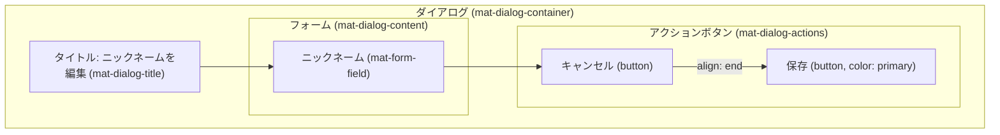
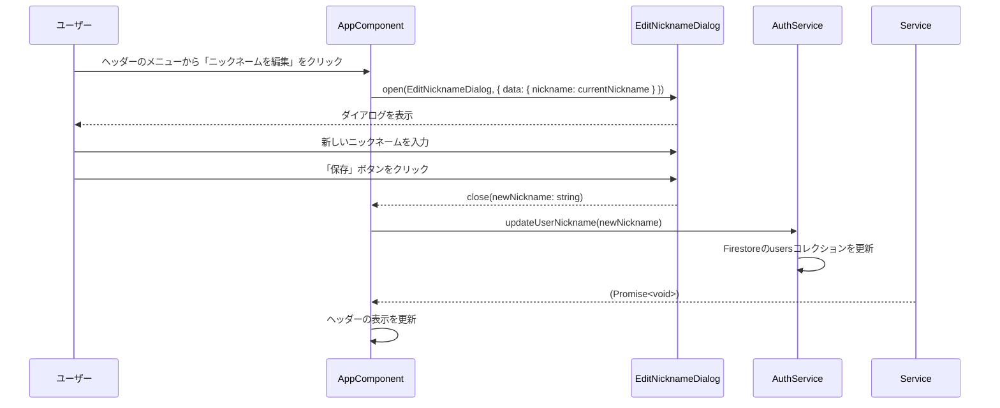

# ニックネーム編集ダイアログ 設計書 (`edit-nickname-dialog.md`)

## 1. 概要

このダイアログは、ユーザーが自身のニックネームを変更するためのシンプルなUIを提供します。
アプリケーションヘッダーのユーザーメニュー内にある「ニックネームを編集」ボタンによって `AppComponent` から呼び出されます。

## 2. ファイル構成

-   **Component**: `src/app/page/list/edit-nickname-dialog/edit-nickname-dialog.component.ts`
-   **Template**: `src/app/page/list/edit-nickname-dialog/edit-nickname-dialog.component.html`
-   **Style**: `src/app/page/list/edit-nickname-dialog/edit-nickname-dialog.component.scss`

## 3. UIレイアウト図



## 4. コンポーネント仕様 (`EditNicknameDialogComponent`)

### 4.1. データモデル

```typescript
// ダイアログに渡されるデータ
export interface NicknameDialogData {
  nickname: string | null;
}

// ダイアログが返すデータ
// string | undefined
```

### 4.2. 入出力

-   **入力 (DI)**: `MAT_DIALOG_DATA`
    -   **型**: `NicknameDialogData`
    -   **説明**: `AppComponent`から渡される、ユーザーの現在のニックネーム。
-   **出力 (Dialog Result)**:
    -   **保存時**: `string` (新しく入力されたニックネーム)
    -   **キャンセル時**: `undefined`

### 4.3. フォームコントロールとバリデーション

| フィールド | コントロール | バリデーション | UI | 備考 |
| :--- | :--- | :--- | :--- | :--- |
| ニックネーム | `[(ngModel)]="data.nickname"` | **必須** (`required`), **最大長** (20文字) | `mat-form-field` | `mat-hint`で文字数カウンターを表示 |

## 5. データフロー (シーケンス図)



1.  `AppComponent`が、ヘッダーのボタンクリックをトリガーに`dialog.open()`を呼び出します。このとき、`AuthService`から取得した現在のニックネームを`data`プロパティに渡します。
2.  ユーザーが新しいニックネームを入力し、「保存」ボタンをクリックします。
3.  ダイアログは、入力された新しいニックネーム（文字列）を結果として返して閉じます。
4.  `AppComponent`は返された文字列を受け取り、`AuthService`の`updateUserNickname()`のようなメソッドを呼び出して、Firestoreの`users`コレクションに保存されているニックネーム情報を更新します。
5.  更新が成功したら、ヘッダーに表示されているニックネームも新しいものに更新します。