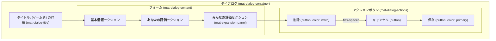
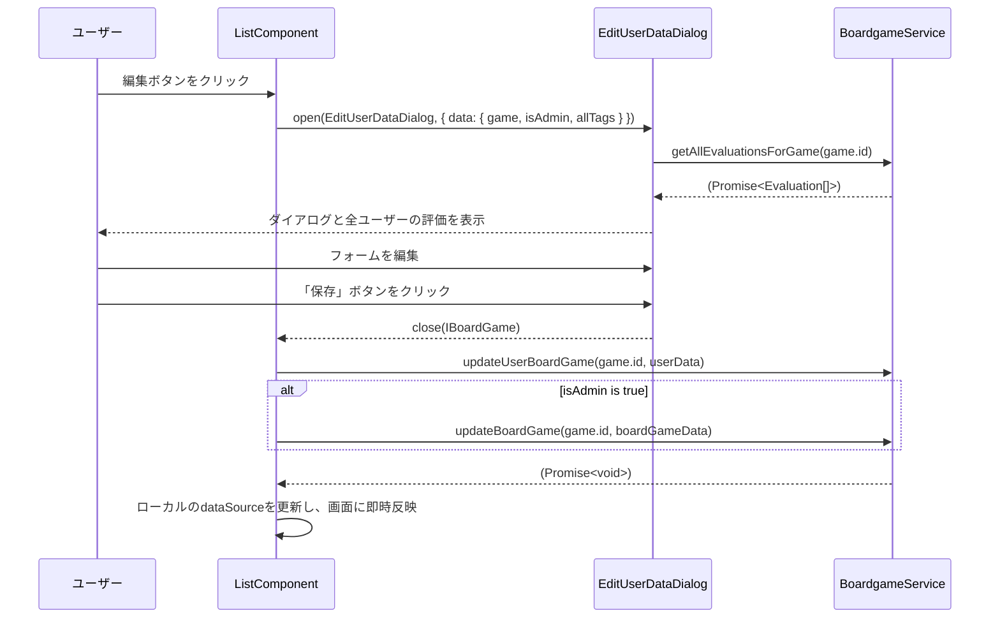
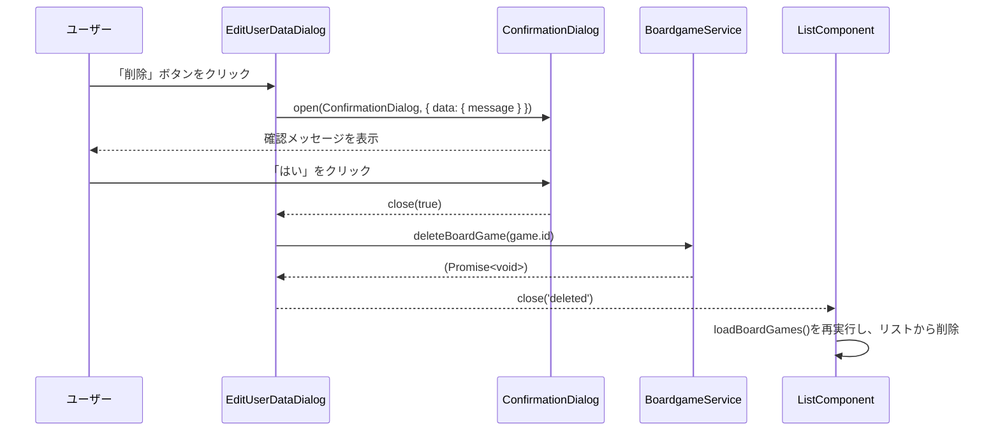

# ゲーム詳細・評価編集ダイアログ 設計書 (`edit-user-data-dialog.md`)

## 1. 概要

このダイアログは、アプリケーションの中核的な機能の一つであり、単一のボードゲームに関する詳細情報の表示と編集を行います。
ユーザーの権限（一般ユーザーか管理者か）に応じて、編集可能な範囲が動的に変わります。
`ListComponent` の各行にある編集ボタン (`edit_note`) によって呼び出されます。

## 2. ファイル構成

-   **Component**: `src/app/page/list/edit-user-data-dialog/edit-user-data-dialog.component.ts`
-   **Template**: `src/app/page/list/edit-user-data-dialog/edit-user-data-dialog.component.html`
-   **Style**: `src/app/page/list/edit-user-data-dialog/edit-user-data-dialog.component.scss`

## 3. UIレイアウト図

## 4. 権限別機能一覧

| UI要素 | 機能 | 一般ユーザー | 管理者 |
| :--- | :--- | :--- | :--- |
| **基本情報** | | |
| 名前 | 編集 | 不可 (readonly) | **可能** |
| 人数 | 編集 | 不可 (readonly) | **可能** |
| 時間 | 編集 | 不可 (readonly) | **可能** |
| 所有者 | 編集 | 不可 (readonly) | **可能** |
| タグ | 追加・削除 | 不可 | **可能** |
| **あなたの評価** | | |
| プレイ済み | チェック | **可能** | **可能** |
| 評価(星) | 編集 | **可能** | **可能** |
| ひとこと | 編集 | **可能** | **可能** |
| **アクション** | | |
| 削除ボタン | 表示・実行 | 非表示 | **表示** |
| 保存ボタン | 実行 | **可能** | **可能** |

## 5. コンポーネント仕様 (`EditUserDataDialogComponent`)

### 5.1. クラスデコレーター

-   `@Component`: `standalone: true` であり、必要なモジュールを `imports` 配列で直接インポートします。

### 5.2. 入出力

-   **入力 (DI)**: `MAT_DIALOG_DATA`
    -   **型**: `EditUserDataDialogData` (`IBoardGame & { isAdmin: boolean; allTags: string[] }`)
    -   **説明**: `ListComponent`から渡される、編集対象のゲーム情報、ユーザーの管理者フラグ、タグのオートコンプリート候補リスト。
-   **出力 (Dialog Result)**:
    -   **保存時**: `IBoardGame` (編集後のデータ)
    -   **削除時**: `'deleted'` (文字列)
    -   **キャンセル時**: `undefined`

### 5.3. 主要なプロパティ

-   `data: IBoardGame`: ダイアログ内の編集データを保持するメインオブジェクト。テンプレートの`ngModel`と双方向バインディングされます。
-   `initialData: EditUserDataDialogData`: `inject(MAT_DIALOG_DATA)`で取得した、変更前の元データ。権限判定などに使用します。
-   `allEvaluationsDataSource`: 「みんなの評価」テーブル用の`MatTableDataSource`。
-   `tagCtrl`: タグ入力用の`FormControl`。

### 5.4. 主要なメソッド

-   `ngOnInit()`: コンポーネント初期化時に`loadAllEvaluations()`を呼び出します。
-   `loadAllEvaluations(): Promise<void>`: `BoardgameService`を呼び出し、このゲームに対する全ユーザーの評価データを非同期で取得し、`allEvaluationsDataSource`にセットします。
-   `onDeleteClick(): Promise<void>`: 削除ボタンクリック時の処理。`ConfirmationDialogComponent`を開き、ユーザーの最終確認を求めます。確認が得られた場合のみ、`BoardgameService.deleteBoardGame()`を呼び出し、ダイアログを`'deleted'`という結果で閉じます。
-   `setRating(rating: number): void`: 評価の星がクリックされたときに`data.evaluation`の値を更新します。
-   `getStarIcon(rating: number, index: number): string`: 評価値に応じた星アイコンの種類（`star`, `star_half`, `star_border`）を返すヘルパーメソッドです。

## 6. データフロー

### 6.1. 保存時のシーケンス図

### 6.2. 削除時のシーケンス図

