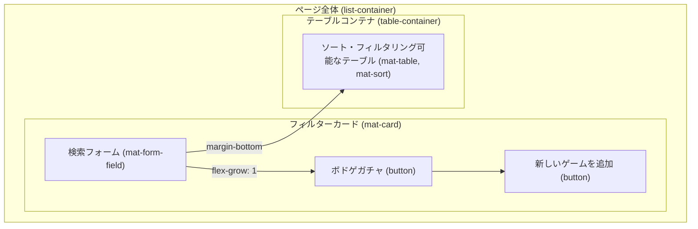
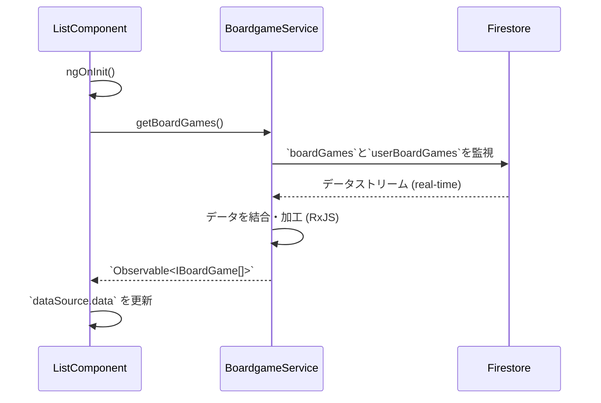
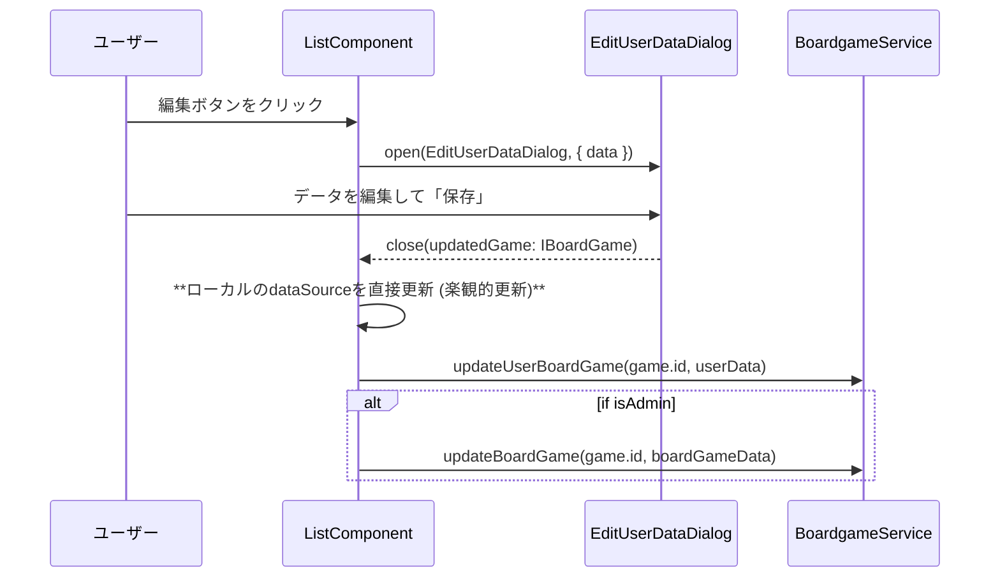

# ボードゲーム一覧ページ 設計書 (`list-page-design.md`)

## 1. 概要

このページは、登録されているボードゲームを一覧で表示し、管理するためのアプリケーションの中心的な画面です。
ユーザーはゲームの検索、ソート、評価の確認、自身のプレイ状況の編集を行えます。
また、管理者権限を持つユーザーは、ボードゲームの追加が可能です。
このドキュメントは、`ListComponent` の詳細な設計を記述します。

## 2. 関連設計書

このページから呼び出される各ダイアログの詳細は、以下のドキュメントを参照してください。

-   [**ボードゲーム追加ダイアログ 設計書**](./add-boardgame-dialog.md)
-   [**ゲーム詳細・評価編集ダイアログ 設計書**](./edit-user-data-dialog.md)
-   [**ボドゲガチャダイアログ 設計書**](./bodoge-gacha-dialog.md)

## 3. 画面レイアウト図

## 4. コンポーネント仕様 (`ListComponent`)

### 4.1. 依存関係 (DI)

-   **`BoardgameService`**: Firestoreとの通信（データ取得・更新）を担当。
-   **`AuthService`**: ユーザーの認証状態とプロファイル（管理者フラグなど）を提供。
-   **`MatDialog`**: 各種ダイアログを開くために使用。
-   **`MatSnackBar`**: ユーザーへのフィードバック（ガチャの結果など）を表示。

### 4.2. 主要プロパティ

-   `isAdmin$: Observable<boolean>`: `AuthService` から取得する、現在のユーザーが管理者であるかどうかの真偽値ストリーム。
-   `dataSource: MatTableDataSource<IBoardGame>`: テーブルのデータを管理するための `MatTableDataSource` インスタンス。
-   `displayedColumns: string[]`: `mat-table` に表示する列の名前を定義する配列。
-   `@ViewChild(MatSort) sort!: MatSort`: テンプレート内の `mat-sort` ディレクティブへの参照。
-   `@ViewChild('searchInput') searchInput!: ElementRef<HTMLInputElement>`: 検索入力フォームへの参照。

### 4.3. ユーザーインタラクションとメソッド

| UI要素 | イベント | 呼び出しメソッド | 処理内容 |
| :--- | :--- | :--- | :--- |
| 検索フォーム | `(keyup)` | `applyFilter($event)` | `dataSource.filter`に値をセットし、テーブルを絞り込む。 |
| クリアボタン | `(click)` | `clearSearch()` | 検索フォームと`dataSource.filter`を空にする。 |
| ガチャボタン | `(click)` | `openGachaDialog()` | `BodogeGachaDialog`を開き、結果に応じて`executeGacha()`を実行。 |
| ゲーム追加ボタン | `(click)` | `openAddBoardGameDialog()` | `AddBoardgameDialog`を開き、結果を`BoardgameService`に渡す。 |
| テーブルヘッダー | `(click)` | (matSort) | `dataSource.sort`に基づき、テーブルをソートする。 |
| タグ (チップ) | `(click)` | `onTagClick(tag)` | クリックされたタグを検索フォームにセットし、フィルタを適用する。 |
| 詳細編集ボタン | `(click)` | `openEditUserDataDialog(game)` | `EditUserDataDialog`を開き、結果に応じて更新処理を行う。 |
| 画像検索ボタン | `(click)` | `openGoogleImageSearch(name)` | Google画像検索を新しいタブで開く。 |

## 5. データフローと状態管理

### 5.1. データ読み込み・表示フロー

1.  **初期化**: `ngOnInit`で`loadBoardGames()`が呼ばれ、`BoardgameService.getBoardGames()`をサブスクライブします。
2.  **データ取得**: `BoardgameService`はFirestoreの`boardGames`と`userBoardGames`コレクションからデータを取得し、RxJSのオペレータを駆使して、各ゲームの基本情報、ログインユーザーのプレイ状況、平均評価などを結合した`IBoardGame[]`のストリームを生成します。
3.  **表示**: `ListComponent`はこのストリームを`dataSource.data`にセットし、`mat-table`にデータを表示します。Firestoreのデータが変更されると、このストリームを通じて自動的に画面が更新されます。

### 5.2. データ更新フロー (編集ダイアログ経由)

-   **楽観的更新**: `ListComponent`は、ダイアログから更新結果を受け取ると、Firestoreからの更新通知を待たずに、まずローカルの`dataSource`を直接更新して画面に即時変更を反映させます。その後、バックグラウンドで`BoardgameService`を通じてFirestoreへの書き込みを行います。これにより、ユーザーは即座に変更結果を確認でき、UIの応答性が向上します。
