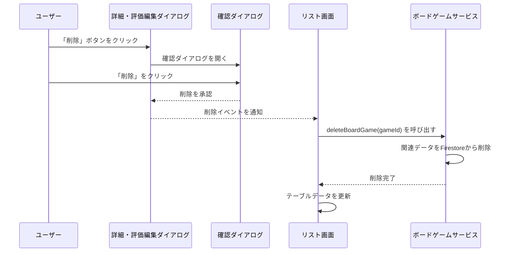

# ボードゲーム一覧ページ 設計書 (`list-page-design.md`)

## 1. 概要

このページは、登録されているボードゲームを一覧で表示し、管理するためのアプリケーションの中心的な画面です。
ユーザーはゲームの検索、評価の確認、自身のプレイ状況の編集を行えます。
また、管理者権限を持つユーザーは、ボードゲームの追加・編集・削除が可能です。
このドキュメントは、`ListComponent` とそれに関連するコンポーネント群の全体的な設計を記述します。

## 2. 関連設計書

このページの機能を構成する各ダイアログコンポーネントのより詳細な設計については、以下のドキュメントを参照してください。

-   [**ボードゲーム追加ダイアログ 設計書**](./add-boardgame-dialog.md)
-   [**ニックネーム編集ダイアログ 設計書**](./edit-nickname-dialog.md)
-   [**ゲーム詳細・評価編集ダイアログ 設計書**](./edit-user-data-dialog.md)

## 3. 画面レイアウトとUI要素

画面は大きく分けて2つのセクションで構成されます。

### 3.1. フィルターセクション (`filter-card`)

画面上部に配置されるカード型コンポーネントで、一覧に対する操作の起点となります。

-   **コンポーネント**: `mat-card`
-   **目的**: 検索機能と、管理者向けのアクションを提供します。
-   **UI要素**:
    -   **ゲーム検索ボックス (`mat-form-field`)**:
        -   **ラベル**: 「ゲームを検索...」
        -   **機能**: 入力されたテキストに基づき、ボードゲーム一覧をリアルタイムに絞り込みます。
        -   **イベント**: `(keyup)` イベントで `applyFilter($event)` メソッドを呼び出します。
        -   **アイコン**: `mat-icon[matSuffix]` で検索アイコンを表示します。
    -   **新しいゲームを追加ボタン (`button[mat-flat-button]`)**:
        -   **ラベル**: 「新しいゲームを追加」
        -   **機能**: `openAddBoardGameDialog()` を呼び出し、新しいボードゲームを登録するためのダイアログを開きます。
        -   **表示条件**: `*ngIf="isAdmin$ | async"`。`AuthService` を通じて得られる管理者状態が `true` の場合にのみ表示されます。

### 3.2. テーブルセクション (`table-container`)

フィルターセクションの下に配置され、ボードゲームの一覧をインタラクティブなテーブル形式で表示します。

-   **コンポーネント**: `table[mat-table]`
-   **データソース**: `[dataSource]="dataSource"`。`ListComponent` の `dataSource` プロパティにバインドされます。
-   **ソート**: `matSort` ディレクティブにより、列ヘッダーのクリックによるソート機能を提供します。
-   **表示項目 (列定義 `displayedColumns`)**:
    -   `name`: ボードゲーム名。横にGoogle画像検索へのリンクアイコン (`image_search`) を配置。
    -   `tags`: ゲームに付与されたタグ。`mat-chip-listbox` と `mat-chip` で表示。
    -   `players`: プレイ可能な人数（例: "3 - 5人"）。
    -   `time`: 平均プレイ時間（例: "60分"）。
    -   `evaluation`: ログインユーザー自身の評価。`getStarIcon()` メソッドに基づき星アイコンで表示。
    -   `averageEvaluation`: 全ユーザーの評価の平均値。同様に星アイコンで表示。
    -   `actions`: 「詳細・評価を編集」ボタン (`edit_note`)。`openEditUserDataDialog()` を呼び出します。
-   **行の定義**:
    -   `mat-header-row`: `*matHeaderRowDef="displayedColumns; sticky: true"`。ヘッダー行を定義し、スクロール時に追従させます。
    -   `mat-row`: `*matRowDef="let row; columns: displayedColumns"`。データ行を定義します。
-   **データなし表示 (`*matNoDataRow`)**:
    -   フィルター検索の結果、表示すべきデータがない場合に「該当するゲームが見つかりません。」というメッセージをテーブル内に表示します。

## 4. コンポーネント仕様 (`ListComponent`)

### 4.1. プロパティ

-   `isAdmin$: Observable<boolean>`: `AuthService` から取得する、現在のユーザーが管理者であるかどうかの真偽値ストリーム。
-   `displayedColumns: string[]`: `mat-table` に表示する列の名前を定義する配列。
-   `dataSource: MatTableDataSource<IBoardGame>`: テーブルのデータを管理するための `MatTableDataSource` インスタンス。
-   `maxStars`, `maxStarsArray`: 評価の星を描画するためのユーティリティプロパティ。
-   `@ViewChild(MatSort) sort!: MatSort`: テンプレート内の `mat-sort` ディレクティブへの参照。`ngAfterViewInit` で `dataSource.sort` に設定します。

### 4.2. ライフサイクルメソッド

-   `constructor`: `BoardgameService`, `MatDialog`, `AuthService` などをDI（依存性注入）します。`dataSource` を空の配列で初期化し、`isAdmin# ボードゲーム一覧ページ 設計書 (`list-page-design.md`)

## 1. 概要

このページは、登録されているボードゲームを一覧で表示し、管理するためのアプリケーションの中心的な画面です。
ユーザーはゲームの検索、評価の確認、自身のプレイ状況の編集を行えます。
また、管理者権限を持つユーザーは、ボードゲームの追加・編集・削除が可能です。
このドキュメントは、`ListComponent` とそれに関連するコンポーネント群の全体的な設計を記述します。

## 2. 関連設計書

このページの機能を構成する各ダイアログコンポーネントのより詳細な設計については、以下のドキュメントを参照してください。

-   [**ボードゲーム追加ダイアログ 設計書**](./add-boardgame-dialog.md)
-   [**ニックネーム編集ダイアログ 設計書**](./edit-nickname-dialog.md)
-   [**ゲーム詳細・評価編集ダイアログ 設計書**](./edit-user-data-dialog.md)

## 3. 画面レイアウトとUI要素

画面は大きく分けて2つのセクションで構成されます。

### 3.1. フィルターセクション (`filter-card`)

画面上部に配置されるカード型コンポーネントで、一覧に対する操作の起点となります。

-   **コンポーネント**: `mat-card`
-   **目的**: 検索機能と、管理者向けのアクションを提供します。
-   **UI要素**:
    -   **ゲーム検索ボックス (`mat-form-field`)**:
        -   **ラベル**: 「ゲームを検索...」
        -   **機能**: 入力されたテキストに基づき、ボードゲーム一覧をリアルタイムに絞り込みます。
        -   **イベント**: `(keyup)` イベントで `applyFilter($event)` メソッドを呼び出します。
        -   **アイコン**: `mat-icon[matSuffix]` で検索アイコンを表示します。
    -   **新しいゲームを追加ボタン (`button[mat-flat-button]`)**:
        -   **ラベル**: 「新しいゲームを追加」
        -   **機能**: `openAddBoardGameDialog()` を呼び出し、新しいボードゲームを登録するためのダイアログを開きます。
        -   **表示条件**: `*ngIf="isAdmin$ | async"`。`AuthService` を通じて得られる管理者状態が `true` の場合にのみ表示されます。

### 3.2. テーブルセクション (`table-container`)

フィルターセクションの下に配置され、ボードゲームの一覧をインタラクティブなテーブル形式で表示します。

-   **コンポーネント**: `table[mat-table]`
-   **データソース**: `[dataSource]="dataSource"`。`ListComponent` の `dataSource` プロパティにバインドされます。
-   **ソート**: `matSort` ディレクティブにより、列ヘッダーのクリックによるソート機能を提供します。
-   **表示項目 (列定義 `displayedColumns`)**:
    -   `name`: ボードゲーム名。横にGoogle画像検索へのリンクアイコン (`image_search`) を配置。
    -   `tags`: ゲームに付与されたタグ。`mat-chip-listbox` と `mat-chip` で表示。
    -   `players`: プレイ可能な人数（例: "3 - 5人"）。
    -   `time`: 平均プレイ時間（例: "60分"）。
    -   `evaluation`: ログインユーザー自身の評価。`getStarIcon()` メソッドに基づき星アイコンで表示。
    -   `averageEvaluation`: 全ユーザーの評価の平均値。同様に星アイコンで表示。
    -   `actions`: 「詳細・評価を編集」ボタン (`edit_note`)。`openEditUserDataDialog()` を呼び出します。
-   **行の定義**:
    -   `mat-header-row`: `*matHeaderRowDef="displayedColumns; sticky: true"`。ヘッダー行を定義し、スクロール時に追従させます。
    -   `mat-row`: `*matRowDef="let row; columns: displayedColumns"`。データ行を定義します。
-   **データなし表示 (`*matNoDataRow`)**:
    -   フィルター検索の結果、表示すべきデータがない場合に「該当するゲームが見つかりません。」というメッセージをテーブル内に表示します。

 を設定します。
-   `ngOnInit()`: コンポーネントが初期化される際に `loadBoardGames()` を呼び出します。
-   `ngAfterViewInit()`: ビューの初期化が完了した後に、`dataSource` にソート機能を紐付けます。

### 4.3. 主要メソッド

-   `loadBoardGames()`: `boardgameService.getBoardGames()` をサブスクライブし、返された `IBoardGame` の配列で `dataSource.data` を更新します。
-   `applyFilter(event: Event)`: 検索ボックスの `keyup` イベントでトリガーされます。入力値を取得し、`dataSource.filter` プロパティに設定することで、テーブルの表示内容を絞り込みます。
-   `openAddBoardGameDialog(): Promise<void>`: 管理者用のゲーム追加ダイアログを開きます。`firstValueFrom` を使ってダイアログが閉じるのを待ち、結果が返された場合は `boardgameService.addBoardGame()` を呼び出してデータを永続化します。
-   `openEditUserDataDialog(game: IBoardGame): Promise<void>`: ゲームの詳細編集ダイアログを開きます。`isAdmin# ボードゲーム一覧ページ 設計書 (`list-page-design.md`)

## 1. 概要

このページは、登録されているボードゲームを一覧で表示し、管理するためのアプリケーションの中心的な画面です。
ユーザーはゲームの検索、評価の確認、自身のプレイ状況の編集を行えます。
また、管理者権限を持つユーザーは、ボードゲームの追加・編集・削除が可能です。
このドキュメントは、`ListComponent` とそれに関連するコンポーネント群の全体的な設計を記述します。

## 2. 関連設計書

このページの機能を構成する各ダイアログコンポーネントのより詳細な設計については、以下のドキュメントを参照してください。

-   [**ボードゲーム追加ダイアログ 設計書**](./add-boardgame-dialog.md)
-   [**ニックネーム編集ダイアログ 設計書**](./edit-nickname-dialog.md)
-   [**ゲーム詳細・評価編集ダイアログ 設計書**](./edit-user-data-dialog.md)

## 3. 画面レイアウトとUI要素

画面は大きく分けて2つのセクションで構成されます。

### 3.1. フィルターセクション (`filter-card`)

画面上部に配置されるカード型コンポーネントで、一覧に対する操作の起点となります。

-   **コンポーネント**: `mat-card`
-   **目的**: 検索機能と、管理者向けのアクションを提供します。
-   **UI要素**:
    -   **ゲーム検索ボックス (`mat-form-field`)**:
        -   **ラベル**: 「ゲームを検索...」
        -   **機能**: 入力されたテキストに基づき、ボードゲーム一覧をリアルタイムに絞り込みます。
        -   **イベント**: `(keyup)` イベントで `applyFilter($event)` メソッドを呼び出します。
        -   **アイコン**: `mat-icon[matSuffix]` で検索アイコンを表示します。
    -   **新しいゲームを追加ボタン (`button[mat-flat-button]`)**:
        -   **ラベル**: 「新しいゲームを追加」
        -   **機能**: `openAddBoardGameDialog()` を呼び出し、新しいボードゲームを登録するためのダイアログを開きます。
        -   **表示条件**: `*ngIf="isAdmin$ | async"`。`AuthService` を通じて得られる管理者状態が `true` の場合にのみ表示されます。

### 3.2. テーブルセクション (`table-container`)

フィルターセクションの下に配置され、ボードゲームの一覧をインタラクティブなテーブル形式で表示します。

-   **コンポーネント**: `table[mat-table]`
-   **データソース**: `[dataSource]="dataSource"`。`ListComponent` の `dataSource` プロパティにバインドされます。
-   **ソート**: `matSort` ディレクティブにより、列ヘッダーのクリックによるソート機能を提供します。
-   **表示項目 (列定義 `displayedColumns`)**:
    -   `name`: ボードゲーム名。横にGoogle画像検索へのリンクアイコン (`image_search`) を配置。
    -   `tags`: ゲームに付与されたタグ。`mat-chip-listbox` と `mat-chip` で表示。
    -   `players`: プレイ可能な人数（例: "3 - 5人"）。
    -   `time`: 平均プレイ時間（例: "60分"）。
    -   `evaluation`: ログインユーザー自身の評価。`getStarIcon()` メソッドに基づき星アイコンで表示。
    -   `averageEvaluation`: 全ユーザーの評価の平均値。同様に星アイコンで表示。
    -   `actions`: 「詳細・評価を編集」ボタン (`edit_note`)。`openEditUserDataDialog()` を呼び出します。
-   **行の定義**:
    -   `mat-header-row`: `*matHeaderRowDef="displayedColumns; sticky: true"`。ヘッダー行を定義し、スクロール時に追従させます。
    -   `mat-row`: `*matRowDef="let row; columns: displayedColumns"`。データ行を定義します。
-   **データなし表示 (`*matNoDataRow`)**:
    -   フィルター検索の結果、表示すべきデータがない場合に「該当するゲームが見つかりません。」というメッセージをテーブル内に表示します。

 の最新値を取得して、ダイアログに渡すデータに含めます。ダイアログが閉じた後、返された結果を元に `boardgameService` の更新メソッド (`updateUserBoardGame`, `updateBoardGame`) を呼び出します。
-   `openDeleteBoardGameDialog(game: IBoardGame): Promise<void>`: 管理者用のゲーム削除ダイアログを開きます。確認ダイアログを表示し、ユーザーの確認が得られた場合に `boardgameService.deleteBoardGame()` を呼び出してデータを削除します。
-   `openGoogleImageSearch(boardgameName: string): void`: ゲーム名を元にGoogle画像検索のURLを生成し、`window.open()` で新しいタブを開きます。
-   `getStarIcon(rating: number, index: number): string`: 評価値（0-5）と星のインデックス（0-4）を基に、表示すべきMaterial Iconの名前（`star`, `star_half`, `star_border`）を返すユーティリティメソッドです。

## 5. データフローと状態管理

1.  **初期表示**: `ListComponent` は `BoardgameService` にデータ取得を要求します。`BoardgameService` はFirestoreの `boardGames` と `userBoardGames` コレクションからデータを取得し、RxJSのオペレータ（`switchMap`, `combineLatest`, `map`）を駆使して、各ゲームの基本情報、ログインユーザーのプレイ状況、平均評価などを結合した `IBoardGame[]` のストリームを生成して返します。`ListComponent` はこのストリームを `dataSource` に流し込みます。
2.  **データ編集**: ユーザーが編集ダイアログでデータを変更・保存すると、ダイアログは変更後の完全な `IBoardGame` オブジェクトを返します。`ListComponent` はそのオブジェクトを受け取り、`BoardgameService` を通じてFirestoreの対応するドキュメント（`boardGames` と `userBoardGames` の両方、または片方）を更新します。
3.  **データ削除**: 管理者が削除ボタンをクリックすると、確認ダイアログが表示されます。ユーザーが削除を確認すると、`ListComponent` は `BoardgameService` を通じてFirestoreの対応するドキュメント（`boardGames` と `userBoardGames` の両方）を削除します。
4.  **画面反映**: Firestoreの更新後、`ListComponent` はFirestoreからのリアルタイム更新を待つのではなく、ローカルに保持している `dataSource.data` の該当する要素を直接更新し、`this.dataSource.data = [...this.dataSource.data]` のように新しい配列をセットすることで、`mat-table` に変更を即時反映させています。これはユーザー体験を向上させるための楽観的更新の一種です。

## 6. サービス依存関係

-   **`BoardgameService`**: Firestoreとの通信をすべて担当する、このコンポーネントの最も重要な依存関係です。データの読み取り、作成、更新処理をカプセル化します。
-   **`AuthService`**: ユーザーのログイン状態、UID、そして管理者であるかどうかの状態を提供します。UIの表示制御（例: 「ゲーム追加」ボタン）に不可欠です。
-   **`MatDialog`**: Angular Materialのダイアログサービス。モーダルダイアログを開くために使用します。