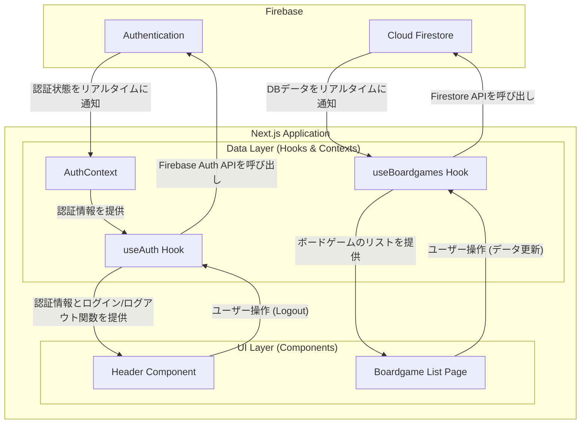

# 設計書: Next.js リアーキテクチャ (HARIDICE)

## 1. 概要

### 1.1. プロジェクトの目的

本プロジェクトは、既存のAngular製ボードゲーム管理アプリケーション「HARIDICE」を、Next.js (React) を用いて再構築（リアーキテクチャ）することを目的とします。

### 1.2. リアーキテクチャのゴール

-   **モダンな技術への刷新:** 最新のReactの機能（Server Components, App Routerなど）を活用し、開発者体験とアプリケーションのパフォーマンスを向上させます。
-   **メンテナンス性の向上:** コンポーネント指向を徹底し、責務を明確に分離することで、将来の機能追加や改修が容易なコードベースを構築します。
-   **堅牢性の確保:** 型安全性をTypeScriptで保証し、Jestによるユニットテストを導入することで、品質の高いアプリケーションを目指します。

---

## 2. 技術スタック

本プロジェクトでは、以下の技術スタックを採用します。

-   **フレームワーク**: Next.js (v16+, App Router)
-   **言語**: TypeScript
-   **UIライブラリ**: MUI (Material-UI)
-   **状態管理**:
    -   **グローバルな状態 (認証など)**: React Context API
    -   **UIのローカルな状態**: `useState`, `useReducer`
    -   **サーバーデータのキャッシュ・取得**: Firebase SDKのリアルタイムリスナーをラップしたカスタムフック (`useAuth`, `useBoardgames`)
-   **フォーム管理**: React Hook Form
-   **スタイリング**: SCSS Modules (既存のCSS資産を活用)
-   **テスト**:
    -   **ユニット/インテグレーションテスト**: Jest, React Testing Library
    -   **E2Eテスト**: Playwright
-   **バックエンド (BaaS)**: Firebase (変更なし)
    -   **データベース**: Cloud Firestore
    -   **認証**: Firebase Authentication

---

## 3. アーキテクチャ設計

### 3.1. ディレクトリ構造

Next.jsのApp Routerの規約に準拠しつつ、責務が明確になるようにディレクトリを構成します。

```
/bg-manager-next
|
|-- /src
|   |
|   |-- /app                 # ページ、レイアウト、ルーティング関連
|   |   |-- /_components     # 特定のページ/レイアウトでのみ使用するプライベートコンポーネント (例: Header)
|   |   |-- layout.tsx       # 全ページ共通のルートレイアウト
|   |   `-- page.tsx         # トップページ (ボードゲーム一覧)
|   |
|   |-- /components          # アプリケーション全体で再利用可能なUIコンポーネント (例: Button, Card)
|   |
|   |-- /contexts            # グローバルな状態を提供するReact Context (例: AuthContext)
|   |
|   |-- /hooks               # ビジネスロジックやデータ取得ロジックをカプセル化したカスタムフック
|   |   |-- useAuth.ts       # 認証関連のロジック
|   |   `-- useBoardgames.ts # ボードゲームデータ関連のロジック
|   |
|   |-- /lib                 # ライブラリの初期化設定やユーティリティ関数
|   |   `-- /firebase        # Firebase SDKの初期化処理
|   |
|   `-- /types               # アプリケーション全体で使用するTypeScriptの型定義
|
|-- jest.config.js           # Jestの設定ファイル
|-- jest.setup.js            # Jestのセットアップファイル
`-- ...                      # Next.jsのその他の設定ファイル
```

### 3.2. データフローと状態管理

本アプリケーションのデータフローは、Firebaseを単一の信頼できる情報源 (Single Source of Truth) とし、UIコンポーネントが必要な情報をカスタムフック経由で購読するリアクティブなモデルを採用します。



-   **`AuthContext`**: `onAuthStateChanged` を利用してFirebase Authenticationの認証状態をリッスンし、ユーザー情報をグローバルに提供します。
-   **`useAuth`**: `AuthContext` から認証情報を取得し、ログイン・ログアウトといったユーザーのアクションを処理する関数を提供します。
-   **`useBoardgames`**: Firestoreのリアルタイムリスナー (`onSnapshot`) を利用してボードゲームのコレクションをリッスンし、常に最新のデータを提供するカスタムフックです。（未実装）

---

## 4. コンポーネント設計

### 4.1. `Layout` (`/app/layout.tsx`)

-   **責務**:
    -   全ページに共通するHTMLの `<html>` と `<body>` タグを定義する。
    -   MUIのテーマプロバイダー (`ThemeRegistry`) を適用する。
    -   認証コンテキストプロバイダー (`AuthProvider`) を適用し、アプリケーション全体で認証情報を利用可能にする。

### 4.2. `Header` (`/app/_components/Header.tsx`)

-   **責務**:
    -   アプリケーションのタイトルを表示する。
    -   `useAuth` フックから認証状態を取得する。
    -   認証状態に応じて、以下のUIを条件付きで表示する。
        -   **ローディング中**: スピナーを表示。
        -   **未ログイン**: 「Googleでログイン」ボタンを表示。
        -   **ログイン済み**: ユーザーのニックネーム（または表示名）と「ログアウト」ボタンを表示。

### 4.3. `BoardgameListPage` (`/app/page.tsx`)

-   **責務**:
    -   `Header`コンポーネントを配置する。
    -   `useBoardgames` フックからボードゲームのリストを取得する。（未実装）
    -   取得したボードゲームのリストをMUIのコンポーネント（`Card`, `Grid`など）を使って表示する。（未実装）

---

## 5. テスト方針

-   **ユニットテスト**:
    -   JestとReact Testing Libraryを使用します。
    -   コンポーネントが与えられた `props` やContextの値に応じて正しくレンダリングされるかをテストします。
    -   カスタムフックが期待されるデータを返し、ロジックが正しいかをテストします。
    -   テストはコンポーネントやフックと同じディレクトリに `*.test.tsx` という命名規則で配置します。
-   **E2Eテスト**:
    -   Playwrightを使用します。
    -   ユーザーの主要な操作フロー（ログイン、データ表示、データ編集など）をシミュレートし、アプリケーション全体が正しく連携して動作することを確認します。
    -   （注: 現在の実行環境ではアプリケーションの起動が困難なため、E2Eテストの実行は保留されています。）
